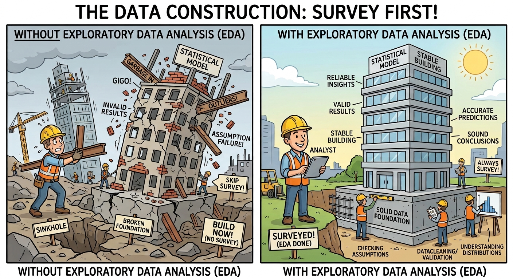
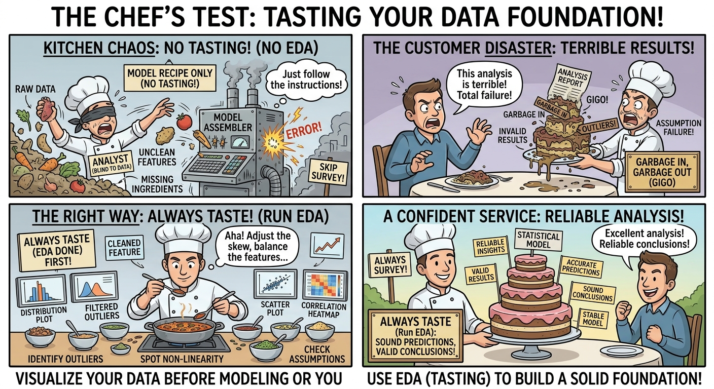

```{r}
#| label: setup
#| include: false
#| message: false
#| warning: false

library(tidyverse)
library(here)
library(knitr)
library(scales)
library(patchwork)

knitr::opts_chunk$set(dev = "ragg_png")

# CASA palette, used explicitly so the deck does not depend on casaviz
casa_purple <- "#4E3C56"
casa_teal   <- "#2E6260"
casa_yellow <- "#F9DD73"
casa_pink   <- "#E16FCA"
casa_green  <- "#9DBB65"
casa_cols   <- c("#2E6260", "#658E62", "#9DBB65", "#E7D870",
                 "#F3C486", "#E993AC", "#8F5289", "#4E3C56")

base_path <- here("sessions", "L6_data", "Performancetables_130242", "2022-2023")

# The DfE publishes suppressed / not-applicable values as codes, not blanks.
# We read them as NA here and return to what they mean later in the lecture.
na_all <- c("", "NA", "SUPP", "NP", "NE", "SP", "SN", "LOWCOV", "NEW", "SUPPMAT")

# Key Stage 4 outcomes: one row per school
ks4 <- read_csv(file.path(base_path, "england_ks4final.csv"),
                na = na_all, show_col_types = FALSE) |>
  mutate(URN = as.character(URN)) |>
  # The DfE files carry LA and national summary rows with no URN. They are not
  # schools, and because dplyr joins NA to NA they would also duplicate rows.
  filter(!is.na(URN)) |>
  select(URN, ATT8SCR, P8MEA, TOTPUPS, TPUP, NUMBOYS, NUMGIRLS,
         PTFSM6CLA1A, TFSM6CLA1A, PTPRIORLO, PTEALGRP2) |>
  mutate(across(c(ATT8SCR, P8MEA, TOTPUPS, TPUP, NUMBOYS, NUMGIRLS,
                  PTFSM6CLA1A, TFSM6CLA1A, PTPRIORLO, PTEALGRP2),
                ~ parse_number(as.character(.x))))

# Absence lives in a separate file, keyed on the same URN
absence <- read_csv(file.path(base_path, "england_abs.csv"),
                    na = na_all, show_col_types = FALSE) |>
  mutate(URN = as.character(URN)) |>
  filter(!is.na(URN)) |>
  distinct(URN, .keep_all = TRUE) |>
  select(URN, PERCTOT) |>
  mutate(PERCTOT = parse_number(as.character(PERCTOT)))

# School characteristics: every school in England, not just secondaries
school_info <- read_csv(file.path(base_path, "england_school_information.csv"),
                        na = na_all, show_col_types = FALSE) |>
  mutate(URN = as.character(URN)) |>
  select(URN, SCHNAME, LANAME, MINORGROUP, SCHOOLTYPE, GENDER,
         OFSTEDRATING, RELCHAR, ADMPOL, OFSTEDLASTINSP)

# Everything with a KS4 result, INCLUDING special and independent schools.
# Keeping them in is the point of several slides below.
schools_all <- ks4 |>
  left_join(school_info, by = "URN") |>
  left_join(absence, by = "URN") |>
  filter(!is.na(ATT8SCR)) |>
  # raw head-count of disadvantaged pupils, for the counts-vs-rates slide
  mutate(n_disadvantaged = round(TPUP * PTFSM6CLA1A / 100),
         # a genuine binary variable: single-sex or not
         single_sex = if_else(GENDER %in% c("Boys", "Girls"),
                              "Single sex", "Mixed"))

# Ofsted is ordinal: set the order once so every plot agrees
ofsted_order <- c("Special Measures", "Serious Weaknesses",
                  "Requires improvement", "Good", "Outstanding")

schools_all <- schools_all |>
  mutate(OFSTEDRATING = factor(OFSTEDRATING, levels = ofsted_order))

# Mainstream secondaries only - the subset used from week 6 onwards
schools_mainstream <- schools_all |>
  filter(MINORGROUP %in% c("Academy", "Maintained school"))
```

# This week

## Understanding and describing data

- Quantitative methods describe the range of mathematical and
  statistical techniques we can apply to data in order that we can
  derive meaning from it
- Data may arrive in many different forms
  - spreadsheets of numbers
  - pages of text
  - ridges on a vinyl record
- Being able to identify the type of data you are dealing with will
  allow you to select the appropriate methods for making sense of it.

::: notes
This lecture focuses on understanding and describing data.

Everything this week uses the dataset we will keep coming back to all
term, so that by week 10 it is completely familiar.
:::

## Survey before you build {.smaller}

{style="max-width:82%; max-height:82%; margin:auto; display:block;"}

::: {style="font-size:0.75em; text-align:center;"}
Nobody pours concrete without surveying the ground first. The same logic
applies to everything we do this term — **the model is only ever as
sound as what it is built on**.
:::

## Exploratory data analysis

Survey before you build in statistics is more formally known as
**exploratory data analysis** - we'll cover it in two weeks.

::: incremental
- **This week — what have I actually got?** What type is each variable,
  what shape does it take, where is its middle, how spread out is it,
  and what is odd or missing about it. All of it *descriptive*:
  statements about the data in front of us.
- **Next week — what lies behind it?** The probability distributions
  those shapes are drawn from, how to transform data that misbehaves,
  and the harder question of whether your data represents anything at
  all.
:::

. . .

This week is deliberately the concrete one. Every single example comes
from one real dataset, which we meet next.

## Learning Objectives

By the end of this lecture you will:

1.  Understand the four basic levels of measurement, and the finer
    statistical data types that build on them;
2.  Be able to describe a variable — its shape, its middle, and its
    spread — and know when each summary is trustworthy;
3.  Recognise missing values and outliers as information rather than
    nuisance;
4.  Know the course dataset well enough to start asking questions of it.

# Our dataset for the term

## School performance in England, 2022/23 {.smaller}

::::: columns
::: {.column width="55%"}
- Published every year by the **Department for Education**
- A full census of every school in England — not a sample
- Hundreds of variables on attainment, pupil characteristics and school
  characteristics
- We will use it in almost every week of this course **Terminology**
- **GCSE** - The exam everyone takes at age 16
- **Ofsted** - the Government Office for Standards in Education (quality
  assurance - they grade schools on how good they are)
- **Academy** - A type of state school outside of local authority
  control
- **Maintained** - A type of state school run by the local authority
- **Attainment 8** and **Progress 8** - Overall GCSE exam scores bundled
  together into a single exam performance metric
:::

::: {.column width="45%"}
```{r}
#| label: dataset-size
#| echo: false

tibble(
  ` ` = c("Schools with a KS4 result",
          "Of which state-run",
          "Variables in the full release",
          "Local authorities covered"),
  `Count` = c(comma(nrow(schools_all)),
              comma(nrow(schools_mainstream)),
              "700+",
              comma(n_distinct(schools_all$LANAME)))
) |>
  kable(align = "lr")
```
:::
:::::

::: footer
DfE:
<https://www.compare-school-performance.service.gov.uk/download-data>
:::

## What a row actually looks like {.smaller}

```{r}
#| label: dataset-peek
#| echo: false

schools_all |>
  filter(LANAME == "Brighton and Hove", MINORGROUP == "Academy") |>
  select(SCHNAME, MINORGROUP, OFSTEDRATING, TOTPUPS, ATT8SCR, PTFSM6CLA1A) |>
  arrange(desc(ATT8SCR)) |>
  head(6) |>
  kable(
    col.names = c("School", "Type", "Ofsted", "Pupils",
                  "Attainment 8", "% disadvantaged"),
    digits = 1
  )
```

- Every row is a **school**. Remember that — it matters later.
- We are never looking at individual pupils in this dataset.

::: notes
Stress the unit of observation. Almost every mistake students make with
this data comes from forgetting that a row is a school, not a child.
:::

## Attainment 8 — our main outcome variable

- Sums each pupil's grades across **8 GCSEs**
- Maths counted twice, English often twice
- Maximum possible score is **90**; 40 is roughly a "standard pass"
  average
- Averaged across all Year 11 pupils to give a **school-level** score

. . .

It is a *raw* score. It takes no account of who a school admits — which
is exactly the problem we spend weeks 6 to 8 solving.

# Data types

## Four levels of measurements

|                                  | Nominal | Ordinal | Interval | Ratio |
|----------------------------------|:-------:|:-------:|:--------:|:-----:|
| Categorizes and labels variables |    ✔    |    ✔    |    ✔     |   ✔   |
| Ranks categories in order        |         |    ✔    |    ✔     |   ✔   |
| Has known, equal intervals       |         |         |    ✔     |   ✔   |
| Has a true or meaningful zero    |         |         |          |   ✔   |

- Developed by psychologist Stanley Smith Stevens (1906 - 1973)

. . .

- This is the classic starting point, and it is where most courses stop.
- We will start with this - but extend it later

## Nominal {.smaller}

::::: columns
::: {.column width="42%"}
- Differentiates items based only on names; no order between them
- Also called **categorical data**
- What can be said about them?
  - :white_check_mark:*Equality*: an Academy is not a Special school
  - :white_check_mark:*Mode*: the most common category

*In our data:* school type, religious character, region, admissions
policy.
:::

::: {.column width="58%"}
```{r}
#| label: nominal-plot
#| echo: false
#| fig-width: 5.6
#| fig-height: 4.2

schools_all |>
  count(MINORGROUP) |>
  mutate(MINORGROUP = fct_reorder(replace_na(MINORGROUP, "Unknown"), n)) |>
  ggplot(aes(x = n, y = MINORGROUP)) +
  geom_col(fill = casa_purple, alpha = 0.85) +
  geom_text(aes(label = comma(n)), hjust = -0.15, size = 3) +
  scale_x_continuous(expand = expansion(mult = c(0, 0.2)), labels = comma) +
  labs(x = "Number of schools", y = NULL) +
  theme_minimal(base_size = 10)
```

[The bars can be reordered freely — there is no natural order
here]{style="font-size:0.7em;"}
:::
:::::

## Ordinal {.smaller}

::::: columns
::: {.column width="42%"}
- Allow for rank order, but not the relative degree of difference
- What can be said about them?
  - :white_check_mark: Equality; mode
  - :white_check_mark: Median: middle-ranked item
  - :x: Differences between two levels; arithmetic mean
- Ordinal can be sub-divided into *weak* (Amazon star ratings on a
  product) and *strong* (1st, 2nd, 3rd finisher in a race)

*In our data:* **Ofsted rating**.
:::

::: {.column width="58%"}
```{r}
#| label: ordinal-plot
#| echo: false
#| fig-width: 5.6
#| fig-height: 4.2

schools_all |>
  filter(!is.na(OFSTEDRATING)) |>
  count(OFSTEDRATING) |>
  ggplot(aes(x = OFSTEDRATING, y = n)) +
  geom_col(fill = casa_teal, alpha = 0.85) +
  geom_text(aes(label = comma(n)), vjust = -0.4, size = 3) +
  scale_y_continuous(expand = expansion(mult = c(0, 0.15)), labels = comma) +
  labs(x = NULL, y = "Number of schools") +
  theme_minimal(base_size = 10) +
  theme(axis.text.x = element_text(angle = 30, hjust = 1))
```

[The order cannot be shuffled — but is Good → Outstanding the same size
a step as Requires improvement → Good?]{style="font-size:0.7em;"}
:::
:::::

## Interval and ratio

**Interval** — differences are meaningful, but the **zero is arbitrary**

- 100°C is **not** twice as hot as 50°C
- *In our data:* the **date of the last Ofsted inspection**. 2015 → 2018
  is the same gap as 2018 → 2021, but "year zero" is a convention.

. . .

**Ratio** — a true, non-arbitrary zero, so ratios are meaningful

- :white_check_mark: Equality, mode, median, arithmetic mean, **and
  ratio**
- *In our data:* **pupils on roll**, **Attainment 8**, **%
  disadvantaged**. A school with 1,200 pupils really does have twice as
  many as one with 600.

## Confusing Ratios: Progress 8 {.smaller}

::::: columns
::: {.column width="40%"}
**Progress 8** compares the progress pupils made with similar pupils
nationally, each year.

- Zero means "average expected progress" - sits in the middle
- Positive is more, negative is less The zero is **meaningful**. So is
  it ratio data? **No.**
- King's scores 0.57 and Blatchington Mill 0.03 — a ratio of **19:1**.
- Not 19 times the progress!
- And Longhill is **negative**, so no ratio is possible at all.
:::

::: {.column width="60%"}
```{r}
#| label: p8-ratio
#| echo: false
#| message: false
#| warning: false
#| fig-width: 6
#| fig-height: 4.6

btn <- schools_mainstream |>
  filter(LANAME == "Brighton and Hove", !is.na(P8MEA), !is.na(ATT8SCR)) |>
  mutate(SCHNAME = str_trunc(SCHNAME, 26),
         SCHNAME = fct_reorder(SCHNAME, P8MEA))

p_att <- ggplot(btn, aes(x = ATT8SCR, y = SCHNAME)) +
  geom_col(fill = casa_teal, alpha = 0.85) +
  scale_x_continuous(limits = c(0, 60), expand = expansion(mult = c(0, 0.05))) +
  labs(title = "Attainment 8 — ratio", subtitle = "zero is a real floor: no marks at all",
       x = NULL, y = NULL) +
  theme_minimal(base_size = 9)

p_p8 <- ggplot(btn, aes(x = P8MEA, y = SCHNAME)) +
  geom_col(aes(fill = P8MEA > 0), alpha = 0.85, show.legend = FALSE) +
  geom_vline(xintercept = 0, colour = "black", linewidth = 0.6) +
  scale_fill_manual(values = c(`TRUE` = casa_purple, `FALSE` = casa_pink)) +
  labs(title = "Progress 8 — interval", subtitle = "zero sits mid-scale: average progress",
       x = NULL, y = NULL) +
  theme_minimal(base_size = 9) +
  theme(axis.text.y = element_blank())

patchwork::wrap_plots(p_att, p_p8, nrow = 1, widths = c(1.35, 1))
```
:::
:::::

::: notes
Same ten Brighton schools on both panels. Left: bars start at a true
zero, so "school A has 1.1 times the attainment of school B" is a
sensible sentence. Right: bars straddle zero, so the same sentence is
meaningless.

This is the slide that stops students assuming "has a zero" means
"ratio". P8MEA appears again later under real-valued additive, where its
symmetry rather than its zero is the point.
:::

# Data types - extended

<!-- ## Why four levels are not enough -->

<!-- Stevens tells us which **operations** are permitted. It does not tell us which -->

<!-- **distribution** a variable follows, or which **model** to fit. -->

<!-- . . . -->

<!-- Take two variables from our data. Both are on a **ratio** scale — both have a -->

<!-- true zero, both support ratios: -->

<!-- | | Pupils on roll | % of sessions missed | -->

<!-- |---|---|---| -->

<!-- | Values | whole numbers | continuous | -->

<!-- | Can be negative? | no | no | -->

<!-- | Upper limit | none in principle | 100 | -->

<!-- | Typical value | ~1,050 | ~9 | -->

<!-- . . . -->

<!-- Stevens says these are the same kind of thing. Let's look at them. -->

<!-- ## Two ratio variables, two different shapes {.smaller} -->

<!-- ```{r} -->

<!-- #| label: two-shapes -->

<!-- #| echo: false -->

<!-- #| message: false -->

<!-- #| warning: false -->

<!-- #| fig-width: 10 -->

<!-- #| fig-height: 4.0 -->

<!-- #| fig-align: center -->

<!-- two <- schools_mainstream |> filter(!is.na(TOTPUPS), !is.na(PERCTOT)) -->

<!-- skw <- function(x) mean((x - mean(x))^3) / sd(x)^3 -->

<!-- shape_panel <- function(d, v, fill_col, ttl, ylab) { -->

<!--   x <- d[[v]] -->

<!--   ggplot(d, aes(x = .data[[v]])) + -->

<!--     geom_histogram(aes(y = after_stat(density)), bins = 35, -->

<!--                    fill = fill_col, alpha = 0.4) + -->

<!--     geom_density(colour = fill_col, linewidth = 1) + -->

<!--     geom_vline(xintercept = mean(x), colour = casa_pink, linewidth = 1) + -->

<!--     geom_vline(xintercept = median(x), colour = "black", -->

<!--                linetype = "dashed", linewidth = 0.8) + -->

<!--     labs(title = paste0(ttl, "  (skew ", sprintf("%.2f", skw(x)), ")"), -->

<!--          subtitle = paste0("mean ", sprintf("%.1f", mean(x)), -->

<!--                            " | median ", sprintf("%.1f", median(x))), -->

<!--          x = NULL, y = ylab) + -->

<!--     theme_minimal(base_size = 13) + -->

<!--     theme(axis.text.y = element_blank(), -->

<!--           plot.subtitle = element_text(size = 9, colour = "grey30")) -->

<!-- } -->

<!-- t1 <- shape_panel(two, "TOTPUPS", casa_purple, "Pupils on roll", "Density") -->

<!-- t2 <- shape_panel(two, "PERCTOT", casa_teal, "% sessions missed", NULL) -->

<!-- patchwork::wrap_plots(t1, t2, nrow = 1) -->

<!-- ``` -->

<!-- ::: {.incremental} -->

<!-- - Left: roughly symmetric, a lump in the middle with tails either side -->

<!-- - Right: a hard floor near zero and a long tail to the right — **skewed** -->

<!-- - **Skew** measures that asymmetry — it is built from *cubed* deviations from the mean, so unlike variance it keeps the sign and can tell you *which* tail is longer. 0 is symmetric, positive means a right tail -->

<!-- - Note where the mean sits relative to the median in each panel -->

<!-- ::: -->

<!-- . . . -->

<!-- Same level of measurement. Different shapes, different distributions, and -->

<!-- different models. Stevens cannot see the difference — so we need something -->

<!-- more specific. -->

## Simple statistical data types {.smaller}

| Data type | Possible values | Level of measurement | Common distributions | Common model |
|---------------|---------------|:-------------:|---------------|---------------|
| **binary** | 0, 1 | nominal | Bernoulli | logistic, probit |
| **categorical** | "name1" … "nameK" | nominal | categorical | multinomial logit / probit |
| **ordinal** | ordered categories | ordinal | categorical | ordered logit / probit |
| **binomial** | 0, 1, …, N | interval | binomial, beta-binomial | binomial regression |
| **real-valued additive** | any real number | interval | normal — symmetric | standard linear regression |
| **count** | 0, 1, 2, … | ratio | Poisson, negative binomial | Poisson / neg. binomial regression |
| **real-valued multiplicative** | positive real | ratio | log-normal, gamma, exponential — skewed | GLM with a logarithmic link |

[Adapted from [Statistical data
type](https://en.wikipedia.org/wiki/Statistical_data_type), Wikipedia
(CC BY-SA)]{style="font-size:0.5em; color:#666;"}

::: notes
The two columns worth dwelling on are the last two. The whole point of
this table is that the data type determines the distribution, and the
distribution determines the model. Everything in weeks 5 to 10 is an
instance of this.
:::

## Every one of these is in our dataset {.smaller}

```{r}
#| label: types-mapping
#| echo: false

tibble(
  `Data type` = c("binary", "categorical", "ordinal", "binomial",
                  "real-valued additive", "count", "real-valued multiplicative"),
  `Variable` = c("single sex / mixed", "MINORGROUP", "OFSTEDRATING",
                 "TFSM6CLA1A out of TPUP", "P8MEA", "TOTPUPS", "PERCTOT"),
  `What it is` = c("Is the school single sex?",
                   "School type",
                   "Ofsted rating",
                   "Disadvantaged pupils out of the cohort",
                   "Progress 8",
                   "Pupils on roll",
                   "% of sessions missed")
) |>
  kable(align = "lll")
```

- Bea will explain more about distributions next week
- And We will meet the model in the right-hand column of the previous
  slide for almost all of these before the course ends.

## And your computer will represent them too {.smaller}

| Statistical type | Programming type | In R | In Python / pandas |
|------------------|------------------|------------------|--------------------|
| real-valued (interval or ratio) | floating point | `numeric` / `double` | `float64` |
| count | integer | `integer` | `int64` |
| binary | Boolean | `logical` | `bool` |
| categorical | enumerated type | `factor` | `category` |
| ordinal | ordered enumerated type | `ordered factor` | `Categorical(ordered=True)` |
| random vector | list or array | `vector` | `ndarray` / `Series` |
| random matrix | two-dimensional array | `matrix` | 2-D `ndarray` |

[Left two columns adapted from [Statistical data
type](https://en.wikipedia.org/wiki/Statistical_data_type), Wikipedia
(CC BY-SA)]{style="font-size:0.5em; color:#666;"}

## A Data Encoding Warning {.smaller}

- Ofsted rating is ORDINAL
- If we store it as {Special Measures:1, ..., Outstanding:5}, is it
  ORDINAL, or INTERVAL?

```{r}
#| label: encoding-warning-table
#| echo: false

# Invented data, deliberately - this is what a great many real extracts look
# like when they reach you, and the point is that nothing about the file
# itself tells you which columns are genuinely numeric.
tibble::tribble(
  ~school_id, ~region, ~ofsted, ~parent_survey, ~attainment8,
      101248,       3,       4,              5,         51.2,
      101319,       7,       2,              3,         43.8,
      101422,       1,       5,              5,         58.6,
      101507,       3,       1,              2,         37.1,
      101663,       9,       3,              4,         46.9
) |>
  knitr::kable(align = "rrrrr")
```

::: {style="font-size:0.8em;"}
`region` is a **nominal** code. `ofsted` and `parent_survey` are
**ordinal** codes. `school_id` is a **label**. Only `attainment8` is a
measurement.
:::

. . .

::: {style="font-size:0.95em;"}
**Five numeric columns. One number.**

Still ordinal. Storing something as a number does not make the gaps
equal — and nothing in the file will tell you which is which.
:::

## ...and this is a common analysis error

::: incremental
- Categorical or ordinal data often arrives **already coded as numbers**
- Software cannot tell. `read_csv` sees 1, 2, 3, 4, 5 and hands you a
  numeric column
- **Nothing errors.** Every summary works. Every model runs.
- So people put it into a regression as a continuous predictor and
  report "each additional unit of Ofsted is worth *x* points"
:::

# Descriptive statistics: the middle and the spread

## Key metrics {.smaller}

**Attainment 8 across all English schools**

```{r}
#| label: att8-summary
#| echo: false

schools_all |>
  summarise(
    `Schools (n)` = comma(n()),
    `Mean`        = sprintf("%.1f", mean(ATT8SCR)),
    `Median`      = sprintf("%.1f", median(ATT8SCR)),
    `Std. dev.`   = sprintf("%.1f", sd(ATT8SCR)),
    `Minimum`     = sprintf("%.1f", min(ATT8SCR)),
    `Maximum`     = sprintf("%.1f", max(ATT8SCR))
  ) |>
  kable(align = "r")
```

- Finding the size, edges and middle of the data gives us a rough sense
  of what we are dealing with and can be a useful short-hand. An
  important first step.

::::: columns
::: {.column width="45%"}
- Quantity (count)
- The middle (mean, median, mode)
- The spread (minximum, maximum, standard deviation)
:::

::: {.column width="55%"}
- **Mean** — add everything up, divide by how many
- **Median** — line them all up, take the middle one
- **Mode** — the most common value
:::
:::::

- However, in data analysis terms, this would be the statistical
  equivalent of preparing some food by only looking at your shopping
  list of ingredients!

# Descriptive statistics - Visualisation

{style="max-width:70%; max-height:70%; margin:auto;"}

## Visualising Your Data - Frequency Distributions {.smaller}

::: {style="font-size:0.8em;"}
A **frequency distribution** lets you see the full shape of your data -
and all of it's quirks.
:::

```{r}
#| label: what-is-a-distribution
#| echo: false
#| message: false
#| warning: false
#| fig-width: 11
#| fig-height: 3.7
#| fig-align: center

dpl <- schools_mainstream |> filter(!is.na(TOTPUPS))

set.seed(1)
d1 <- ggplot(dpl, aes(x = TOTPUPS, y = runif(nrow(dpl)))) +
  geom_point(alpha = 0.12, colour = casa_purple, size = 0.7) +
  labs(title = "1. Every school is a point", x = "Pupils on roll", y = NULL) +
  theme_minimal(base_size = 12) +
  theme(axis.text.y = element_blank(), panel.grid.major.y = element_blank())

d2 <- ggplot(dpl, aes(x = TOTPUPS)) +
  geom_histogram(bins = 35, fill = casa_purple, alpha = 0.7) +
  labs(title = "2. Count them into bins", x = "Pupils on roll", y = "Schools") +
  theme_minimal(base_size = 12)

d3 <- ggplot(dpl, aes(x = TOTPUPS)) +
  geom_histogram(aes(y = after_stat(density)), bins = 35,
                 fill = casa_purple, alpha = 0.35) +
  geom_density(colour = casa_pink, linewidth = 1) +
  labs(title = "3. That shape is the distribution", x = "Pupils on roll",
       y = "Density") +
  theme_minimal(base_size = 12) +
  theme(axis.text.y = element_blank())

patchwork::wrap_plots(d1, d2, d3, nrow = 1)
```

::: incremental
- The **histogram** is the workhorse: bin the values (any size bin you
  like), count how many land in each bin
- The smooth curve is the same information with the bins taken away -
  **More Next week**
- Almost everything else in this course starts by asking what shape
  (*Frequency Distribution*) a variable has
:::

## A boxplot is a summarised histogram {.smaller}

```{r}
#| label: hist-to-boxplot
#| echo: false
#| message: false
#| warning: false
#| fig-width: 9.5
#| fig-height: 4.2
#| fig-align: center

hb <- schools_mainstream |> filter(!is.na(ATT8SCR))
q  <- quantile(hb$ATT8SCR, c(0.25, 0.5, 0.75))

h_top <- ggplot(hb, aes(x = ATT8SCR)) +
  geom_histogram(bins = 45, fill = casa_purple, alpha = 0.55) +
  geom_vline(xintercept = q, colour = casa_pink, linetype = "dashed") +
  scale_y_continuous(expand = expansion(mult = c(0, 0.08))) +
  labs(x = NULL, y = "Schools") +
  theme_minimal(base_size = 11) +
  theme(axis.text.x = element_blank())

b_bot <- ggplot(hb, aes(x = ATT8SCR, y = "")) +
  geom_boxplot(fill = casa_purple, alpha = 0.55, outlier.alpha = 0.3,
               outlier.size = 0.7) +
  geom_vline(xintercept = q, colour = casa_pink, linetype = "dashed") +
  labs(x = "Attainment 8", y = NULL) +
  theme_minimal(base_size = 11)

patchwork::wrap_plots(h_top, b_bot, ncol = 1, heights = c(3, 1))
```

::: incremental
- A **boxplot** or a *box and whisker* plot - same data, same axis. The
  dashed lines are the **quartiles**
- The **box** holds the middle 50% of schools (the **inter-quartile
  range or IQR)**; the line inside it is the **median**
- The **whiskers** reach the furthest point within 1.5 × the box width;
  anything beyond it (the dots) are known as **outliers** - more later
- A boxplot is a histogram with the shape thrown away and **five numbers
  kept**
:::

::: notes
Which is the trade. You lose the shape entirely - a boxplot cannot show
you two humps - but you gain the ability to put many of them side by
side, which we do later in this lecture.
:::

## Four ways to draw the same distribution {.smaller}

```{r}
#| label: four-views
#| echo: false
#| message: false
#| warning: false
#| fig-width: 10
#| fig-height: 4.4
#| fig-align: center

library(ggdist)

# Every school with a score, INCLUDING special and independent. That is
# deliberate - this is the one variable in the deck with obvious multiple
# humps, and it is what makes the boxplot panel fail so visibly.
fv <- schools_all |> filter(!is.na(ATT8SCR))

base <- function(p) p + labs(x = NULL, y = NULL) +
  theme_minimal(base_size = 10) +
  theme(plot.title = element_text(size = 10, face = "bold"),
        axis.text.y = element_blank(), panel.grid.minor = element_blank())

p_hist <- base(
  ggplot(fv, aes(x = ATT8SCR)) +
    geom_histogram(bins = 45, fill = casa_purple, alpha = 0.7) +
    labs(title = "Histogram"))

p_box <- base(
  ggplot(fv, aes(x = ATT8SCR, y = "")) +
    geom_boxplot(fill = casa_teal, alpha = 0.7, outlier.alpha = 0.25,
                 outlier.size = 0.6) +
    labs(title = "Boxplot"))

p_vio <- base(
  ggplot(fv, aes(x = ATT8SCR, y = "")) +
    geom_violin(fill = casa_green, alpha = 0.7, colour = NA) +
    labs(title = "Violin"))

p_rain <- base(
  ggplot(fv, aes(x = ATT8SCR, y = "")) +
    stat_halfeye(fill = casa_pink, alpha = 0.6, adjust = 0.6,
                 width = 0.6, .width = 0, point_colour = NA) +
    geom_boxplot(width = 0.12, alpha = 0.6, outlier.alpha = 0.15,
                 outlier.size = 0.5) +
    stat_dots(side = "left", dotsize = 0.35, justification = 1.1,
              colour = casa_purple, alpha = 0.3) +
    labs(title = "Raincloud"))

patchwork::wrap_plots(p_hist, p_box, p_vio, p_rain, nrow = 2)
```

::: {style="font-size:0.8em;"}
The same `r comma(nrow(fv))` schools and the same Attainment 8 scores,
four times over. **Three of these show you that the data has more than
one hump. One of them does not.**
:::

## What each one keeps, and what it throws away {.smaller}

|   | What it shows you | What it hides | Reach for it when |
|------------------|------------------|------------------|------------------|
| **Histogram** | the full shape, every bump and gap | no summary statistics marked | exploring **one** variable properly |
| **Boxplot** | median, quartiles, outliers — five numbers | **the shape, completely** | comparing **many** groups at once |
| **Violin** | the full shape, mirrored | individual points, and how many there are | comparing a **few** groups where shape matters |
| **Raincloud** | shape, summary **and** every observation | gets crowded fast | one or two groups, when you want to show everything |

. . .

::: {style="font-size:0.9em;"}
All four are answering the same question — *how many observations fall
where?* They differ only in how much they summarise before they show
you.
:::

::: {style="background-color:#2e6260; color:white; padding:8px; border-radius:5px; font-size:0.82em;"}
**The boxplot on the last slide looked perfectly ordinary.** The data it
was drawn from has three separate humps — special schools, independent
schools and mainstream schools, piled on top of each other. A boxplot
will never tell you that. **Always look at the shape before you
summarise it.**
:::

::: notes
The three humps are at roughly 2.5, 21 and 45 on the Attainment 8 scale,
and they correspond to special schools, independent schools and
mainstream schools respectively. Worth naming out loud - it connects
straight back to the population-versus-sample slides earlier, where we
filtered exactly these groups out.

If anyone asks why the violin looks symmetric: it is the same density
drawn twice, mirrored. It carries no more information than half of it
would.
:::

## Count Data {.smaller}

```{r}
#| label: type-count
#| echo: false
#| message: false
#| warning: false
#| fig-width: 10
#| fig-height: 4.3
#| fig-align: center

library(ggdist)

# Five genuine counts from the same schools, drawn on one shared axis. The
# scales are deliberately not comparable - that is the point the slide makes,
# and it sets up the standard-score material later in the lecture.
counts_long <- schools_mainstream |>
  select(TFSM6CLA1A, TPUP, NUMGIRLS, NUMBOYS) |>
  pivot_longer(everything(), names_to = "variable", values_to = "count") |>
  filter(!is.na(count)) |>
  mutate(variable = recode(variable,
           TFSM6CLA1A = "Disadvantaged pupils",
           TPUP       = "Pupils in the cohort",
           NUMGIRLS   = "Girls on roll",
           NUMBOYS    = "Boys on roll"),
         variable = fct_reorder(variable, count, .fun = median))

ggplot(counts_long, aes(x = count, y = variable, fill = variable)) +
  stat_halfeye(adjust = 0.6, width = 0.6, .width = 0,
               justification = -0.15, point_colour = NA, alpha = 0.75) +
  geom_boxplot(width = 0.12, outlier.shape = NA, alpha = 0.5) +
  stat_dots(side = "left", justification = 1.12, quantiles = 120,
            colour = NA, alpha = 0.45) +
  scale_fill_manual(values = c(casa_yellow, casa_green, casa_pink, casa_teal)) +
  scale_x_continuous(labels = comma, expand = expansion(mult = c(0.02, 0.05))) +
  labs(x = "Count (pupils)", y = NULL) +
  theme_minimal(base_size = 11) +
  theme(legend.position = "none", panel.grid.minor = element_blank())
```

```{r}
#| label: count-values
#| include: false

# Short names on purpose. The front matter sets editor wrap:72, so RStudio
# reflows the markdown on save - and a long `r sprintf(...)` call inside a
# bullet gets broken across lines and mangled. Precomputing here keeps the
# inline calls to a couple of characters, so the bullets survive a reflow.
mean_pupils <- sprintf("%.0f", mean(schools_mainstream$TOTPUPS, na.rm = TRUE))
med_fsm     <- sprintf("%.0f", median(schools_mainstream$TFSM6CLA1A, na.rm = TRUE))
med_boys    <- sprintf("%.0f", median(schools_mainstream$NUMBOYS, na.rm = TRUE))
```

::: {style="font-size:0.78em;"}
Five counts, one axis. Each **cloud** is the distribution, the **box**
the quartiles, the **rain** below it the schools themselves.
:::

## Count Data {.smaller}

- Whole numbers, never negative, no upper limit in principle
- A mean of `r mean_pupils` pupils is meaningful; a school with 1,204.7
  pupils is not
- Distribution: **Poisson** or **negative binomial**, not normal

. . .

- Now look at the bottom of that chart
- **Disadvantaged pupils** (median `r med_fsm`) all but vanishes beside
  **boys on roll** (median `r med_boys`)
- Same data type, same axis — and still not comparable

. . .

::: {style="background-color:#2e6260; color:white; padding:8px; border-radius:5px; font-size:0.82em;"}
**Hold that thought.** Is a school with 120 disadvantaged pupils more
unusual than one with 900 boys on roll? You cannot answer that from this
chart — the units are different and so are the spreads. Later today we
fix it, by converting both to **standard scores**.
:::

## Binomial Data {.smaller}

```{r}
#| label: type-binomial
#| echo: false
#| fig-width: 9
#| fig-height: 3.6
#| fig-align: center

# Twelve real schools, drawn as containers rather than points. The full bar is
# the cohort - the ceiling N - and the filled part is how many of them are
# disadvantaged. One axis, and the ceiling is a thing you can see rather than
# a line you have to be told about. Scatter plots are saved for week 6.
set.seed(11)
binom_ex <- schools_mainstream |>
  filter(!is.na(TFSM6CLA1A), !is.na(TPUP), TPUP > 0, !is.na(SCHNAME)) |>
  slice_sample(n = 12) |>
  mutate(rest = TPUP - TFSM6CLA1A,
         school = fct_reorder(str_trunc(SCHNAME, 26), TPUP))

binom_ex |>
  select(school, Disadvantaged = TFSM6CLA1A, `Everyone else` = rest) |>
  pivot_longer(-school, names_to = "group", values_to = "n") |>
  mutate(group = factor(group, levels = c("Everyone else", "Disadvantaged"))) |>
  ggplot(aes(x = n, y = school, fill = group)) +
  geom_col(width = 0.72) +
  geom_text(data = binom_ex, inherit.aes = FALSE,
            aes(x = TPUP, y = school, label = paste0("N = ", TPUP)),
            hjust = -0.15, size = 3, colour = "grey30") +
  scale_fill_manual(values = c("Everyone else" = "grey85",
                               "Disadvantaged" = casa_teal), name = NULL) +
  scale_x_continuous(expand = expansion(mult = c(0, 0.16))) +
  labs(x = "Pupils in the cohort", y = NULL) +
  theme_minimal(base_size = 11) +
  theme(legend.position = "top", panel.grid.major.y = element_blank())
```

- A count **bounded above** by the size of the cohort — it cannot exceed
  an upper ceiling **N** — e.g. a finite number of coin tosses, or
  children in a school
- **Each bar is a school's ceiling.** The teal part is the count; it can
  never spill past the end of its own bar
- Every school has a *different* ceiling, which is why the raw count
  tells you so little
- Distribution: **binomial**. This is why a percentage is the natural
  summary.

## Real-valued additive {.smaller}

```{r}
#| label: type-additive
#| echo: false
#| fig-width: 9
#| fig-height: 3.4
#| fig-align: center

p8 <- schools_mainstream |> filter(!is.na(P8MEA))

ggplot(p8, aes(x = P8MEA)) +
  geom_histogram(bins = 50, fill = casa_purple, alpha = 0.65) +
  geom_vline(xintercept = mean(p8$P8MEA), colour = casa_pink, linewidth = 1) +
  geom_vline(xintercept = median(p8$P8MEA), colour = "black",
             linetype = "dashed", linewidth = 0.8) +
  scale_y_continuous(expand = expansion(mult = c(0, 0.08))) +
  labs(subtitle = paste0("mean ", sprintf("%.3f", mean(p8$P8MEA)),
                         " | median ", sprintf("%.3f", median(p8$P8MEA)),
                         "  — the two lines are on top of each other"),
       x = "Progress 8", y = "Schools") +
  theme_minimal(base_size = 12)
```

- A real number can be placed anywhere on a line - i.e. can have a
  decimal
- Can be **negative**. Symmetric about its mean.
- Mean `r sprintf("%.3f", mean(p8$P8MEA))` (pink like), median
  `r sprintf("%.3f", median(p8$P8MEA))` (black dotted) — almost
  identical
- Distribution: **normal**. Model: **ordinary linear regression** —
  weeks 6 and 7.

## Real-valued multiplicative {.smaller}

```{r}
#| label: type-multiplicative
#| echo: false
#| message: false
#| warning: false
#| fig-width: 10
#| fig-height: 3.6
#| fig-align: center

abs_pos <- schools_mainstream |> filter(!is.na(PTEALGRP2), PTEALGRP2 > 0)
sk <- function(x) mean((x - mean(x))^3) / sd(x)^3

mu_abs  <- mean(abs_pos$PTEALGRP2)
med_abs <- median(abs_pos$PTEALGRP2)

# Both panels plot the same variable and mark the same two statistics, so the
# lines sit at identical values. Only the spacing of the axis differs.
abs_lines <- list(
  geom_vline(xintercept = mu_abs,  colour = casa_pink, linewidth = 1),
  geom_vline(xintercept = med_abs, colour = "black",
             linetype = "dashed", linewidth = 0.8)
)

p_raw <- ggplot(abs_pos, aes(x = PTEALGRP2)) +
  geom_histogram(bins = 40, fill = casa_purple, alpha = 0.65) +
  abs_lines +
  labs(title = paste0("As published  (skew = ", sprintf("%.2f", sk(abs_pos$PTEALGRP2)), ")"),
       subtitle = paste0("mean ", sprintf("%.1f", mu_abs),
                         " | median ", sprintf("%.1f", med_abs)),
       x = "% of pupils with English as an additional language", y = "Schools") +
  theme_minimal(base_size = 11) +
  theme(plot.subtitle = element_text(size = 8, colour = "grey30"))

p_log <- ggplot(abs_pos, aes(x = PTEALGRP2)) +
  geom_histogram(bins = 40, fill = casa_teal, alpha = 0.65) +
  abs_lines +
  scale_x_log10(breaks = c(1, 3, 10, 30, 100)) +
  labs(title = paste0("On a log scale  (skew = ",
                      sprintf("%.2f", sk(log(abs_pos$PTEALGRP2))), ")"),
       subtitle = "same mean, same median, same data",
       x = "% EAL (log scale)", y = "Schools") +
  theme_minimal(base_size = 11) +
  theme(plot.subtitle = element_text(size = 8, colour = "grey30"))

patchwork::wrap_plots(p_raw, p_log, nrow = 1)
```

- Strictly positive, and **strongly skewed** (mean and median very
  different) — most schools have few EAL pupils, a long tail have very
  many
- Both panels show the same percentages, the same mean and the same
  median. Only the **spacing of the axis** changes: equal distances now
  mean equal ***multiples*** rather than equal *amounts* (additive)
- On that spacing the distribution is very nearly symmetric, and the
  mean sits close to the middle of it
- This is not a trick. It is what the data type tells us to do — and it
  is exactly what we do in **week 6** when we fit a log-log model.

## Real-valued multiplicative

```{r}
#| label: type-multiplicative-why
#| echo: false
#| message: false
#| warning: false
#| fig-width: 10
#| fig-height: 3.2
#| fig-align: center

# Six real schools, chosen so each has roughly double the EAL share of the one
# before. On a linear axis the gaps grow; on a log axis they are equal. That
# is the whole of what a logarithmic scale does.
targets <- c(3, 6, 12, 24, 48, 96)
picked <- map_dfr(targets, function(t) {
  abs_pos |>
    mutate(gap = abs(PTEALGRP2 - t)) |>
    slice_min(gap, n = 1, with_ties = FALSE) |>
    transmute(PTEALGRP2)
}) |>
  distinct(PTEALGRP2) |>
  arrange(PTEALGRP2)

base_strip <- function(dat, logscale) {
  p <- ggplot(dat, aes(x = PTEALGRP2, y = 0)) +
    geom_segment(aes(xend = PTEALGRP2, y = -0.12, yend = 0.12),
                 colour = casa_purple, linewidth = 0.6) +
    geom_point(size = 4, colour = casa_pink) +
    geom_text(aes(label = PTEALGRP2), vjust = -1.6, size = 3.6) +
    scale_y_continuous(limits = c(-0.6, 0.6)) +
    theme_minimal(base_size = 11) +
    theme(axis.text.y = element_blank(), panel.grid = element_blank(),
          axis.title.y = element_blank())
  if (logscale) {
    p + scale_x_log10(breaks = dat$PTEALGRP2) +
      labs(title = "On a log axis: every gap is the same",
           x = "% EAL (log scale)")
  } else {
    p + labs(title = "On a linear axis: the gaps keep growing",
             x = "% EAL")
  }
}

patchwork::wrap_plots(base_strip(picked, FALSE),
                      base_strip(picked, TRUE), nrow = 2)
```

::: {style="font-size:0.78em;"}
Six real schools, each with roughly **twice** the share of the one
before. The jump from 3% to 6% and the jump from 48% to 96% are *the
same size* — as multiples. A logarithmic axis is simply an axis that
agrees.
:::

::: {style="background-color:#2e6260; color:white; padding:8px; border-radius:5px; font-size:0.78em;"}
**Next week.** Bea takes this apart properly — exponentials, logarithms,
and when to reach for them. For now, just notice that changing the
*spacing* changed the *shape*.
:::

::: notes
If someone asks: the pink line is the ordinary arithmetic mean of the
percentages, plotted at the same value on both panels. The natural
centre of a multiplicative variable is really the geometric mean - exp
of the mean of the logs - which lands closer to the median. Not worth
opening up here, but it is the reason logged models are quoted as
percentage changes.
:::

## Why any of this matters {.smaller}

| If your outcome is…        | …the model you need is           | Covered in |
|----------------------------|----------------------------------|------------|
| real-valued additive       | linear regression                | weeks 6, 7 |
| real-valued multiplicative | linear regression on logged data | weeks 6, 7 |
| grouped / nested           | linear mixed effects             | week 8     |
| binary                     | logistic regression              | week 8     |
| ordinal                    | ordered logistic regression      | week 8     |
| count                      | Poisson regression               | week 8     |

. . .

- **Choosing the wrong one does not usually throw an error.**
- It quietly gives you a plausible, wrong answer.
- Knowing your data type is the defence.

## Attainment 8 across all English schools (again) {.smaller}

```{r}
#| label: att8-summary1
#| echo: false

schools_all |>
  summarise(
    `Schools (n)` = comma(n()),
    `Mean`        = sprintf("%.1f", mean(ATT8SCR)),
    `Median`      = sprintf("%.1f", median(ATT8SCR)),
    `Std. dev.`   = sprintf("%.1f", sd(ATT8SCR)),
    `Minimum`     = sprintf("%.1f", min(ATT8SCR)),
    `Maximum`     = sprintf("%.1f", max(ATT8SCR))
  ) |>
  kable(align = "r")
```

::: incremental
- Quantity: `r comma(nrow(schools_all))` schools
- The middle: mean `r sprintf("%.1f", mean(schools_all$ATT8SCR))`,
  median `r sprintf("%.1f", median(schools_all$ATT8SCR))`
- **The mean is *lower* than the median.** Why?
:::

::: notes
Do not resolve this yet — it is the hook for the visualisation section.
:::

## So why is the mean below the median?

```{r}
#| label: att8-hist-all
#| echo: false
#| fig-width: 10
#| fig-height: 4.6
#| fig-align: center

mean_all   <- mean(schools_all$ATT8SCR)
median_all <- median(schools_all$ATT8SCR)

ggplot(schools_all, aes(x = ATT8SCR)) +
  geom_histogram(binwidth = 1, fill = casa_purple, alpha = 0.55) +
  geom_vline(xintercept = median_all, colour = "black",
             linetype = "dotted", linewidth = 1) +
  geom_vline(xintercept = mean_all, colour = casa_yellow, linewidth = 1) +
  annotate("text", x = median_all, y = Inf,
           label = paste0("Median = ", round(median_all, 1)),
           hjust = -0.05, vjust = 2, size = 4) +
  annotate("text", x = mean_all, y = Inf,
           label = paste0("Mean = ", round(mean_all, 1)),
           hjust = 1.05, vjust = 2, size = 4, colour = "#B89B10") +
  scale_y_continuous(expand = expansion(mult = c(0, 0.08))) +
  labs(title = "Attainment 8, all English schools with a KS4 result, 2022/23",
       x = "Average Attainment 8 score", y = "Number of schools") +
  theme_minimal(base_size = 13)
```

- One summary table told us mean \< median. **One picture tells us
  why.**
- There is a whole second population of schools down at the left.

## The same data, split by school type

```{r}
#| label: att8-hist-bytype
#| echo: false
#| fig-width: 10
#| fig-height: 4.6
#| fig-align: center

schools_all |>
  mutate(MINORGROUP = replace_na(MINORGROUP, "Unknown")) |>
  ggplot(aes(x = ATT8SCR, fill = MINORGROUP)) +
  geom_histogram(binwidth = 1, alpha = 0.85, position = "stack") +
  scale_fill_manual(values = casa_cols) +
  scale_y_continuous(expand = expansion(mult = c(0, 0.08))) +
  labs(title = "The left-hand hump is special schools",
       x = "Average Attainment 8 score", y = "Number of schools",
       fill = "School type") +
  theme_minimal(base_size = 13) +
  theme(legend.position = "bottom")
```

- **Special schools** educate pupils with significant special
  educational needs
- Attainment 8 was never designed to compare them with mainstream
  schools

## What that does to the headline number {.smaller}

```{r}
#| label: att8-bytype-table
#| echo: false

schools_all |>
  mutate(MINORGROUP = replace_na(MINORGROUP, "Unknown")) |>
  group_by(`School type` = MINORGROUP) |>
  summarise(
    n        = n(),
    Mean     = round(mean(ATT8SCR), 1),
    Median   = round(median(ATT8SCR), 1),
    `Std dev` = round(sd(ATT8SCR), 1),
    .groups = "drop"
  ) |>
  arrange(Mean) |>
  kable(align = "lrrrr")
```

::: incremental
- Mixing these together produces a mean that describes **no real
  school**
- The fix is not statistical, it is *knowing what is in your data*
- From week 6 onwards we work with mainstream secondaries only — now you
  know why
:::

## Careful — we have just changed what we are studying

```{r}
#| label: pop-to-sample
#| echo: false

keep <- c("Academy", "Maintained school")

schools_all |>
  mutate(grp = if_else(MINORGROUP %in% keep, "Kept", "Dropped")) |>
  group_by(grp, `School type` = replace_na(MINORGROUP, "Unknown")) |>
  summarise(Schools = n(), .groups = "drop") |>
  arrange(grp, desc(Schools)) |>
  transmute(` ` = grp, `School type`, Schools = comma(Schools)) |>
  kable(align = "llr")
```

::: incremental
- We began with a **population**: every school in England with a KS4
  result
- Filtering to academies and maintained schools leaves a **subset** — or
  a **sample** and it is not a random one
- Anything we now conclude is about **mainstream state-funded
  secondaries**, not "schools"
:::

## Dropping cases is a decision, not a technicality {.smaller}

::: incremental
- **Special schools** are excluded because Attainment 8 was never
  designed to describe them — defensible, but it removes the
  lowest-attaining pupils in the country from view
- **Independent schools** are excluded because they sit outside the
  state system — also defensible, and it removes much of the top of the
  distribution
- Neither group left by accident. **We chose.**
:::

. . .

Recall the first slides: a sample only tells you about the population it
was drawn from. The moment you filter, you have redefined that
population — so say which one you mean.

::: {style="background-color:#2e6260; color:white; padding:10px; border-radius:5px; font-size:0.85em;"}
**Next week.** Representative data, selection bias, and what happens to
your conclusions when the cases you dropped are not like the ones you
kept.
:::

::: notes
Worth saying out loud that this is the single most common unexamined
step in student analyses: a filter applied early, for a good reason, and
then never mentioned again in the write-up.

The assessment asks them to justify their data choices — this is what
that means in practice.
:::

## The middle is not enough

```{r}
#| label: same-mean-diff-spread
#| echo: false
#| message: false
#| warning: false
#| fig-width: 9
#| fig-height: 3.9
#| fig-align: center

pair <- schools_all |>
  filter(MINORGROUP %in% c("Academy", "Maintained school"))

pair_stats <- pair |>
  group_by(MINORGROUP) |>
  summarise(n = n(), mean = mean(ATT8SCR), sd = sd(ATT8SCR), .groups = "drop")

library(ggdist)

# Raincloud rather than a plain violin, to match the Count and Binomial
# slides. The rain is NOT subsampled here on purpose: academies outnumber
# maintained schools four to one, and the depth of the dot stack is the only
# part of the picture that shows it.
ggplot(pair, aes(x = ATT8SCR, y = MINORGROUP, fill = MINORGROUP)) +
  stat_halfeye(adjust = 0.7, width = 0.55, .width = 0,
               justification = -0.10, point_colour = NA, alpha = 0.55) +
  geom_boxplot(width = 0.09, outlier.shape = NA,
               fill = "white", alpha = 0.9) +
  stat_dots(side = "left", justification = 1.08, colour = NA, alpha = 0.30) +
  geom_point(data = pair_stats, aes(x = mean, y = MINORGROUP),
             inherit.aes = FALSE, colour = casa_pink, size = 3) +
  geom_text(data = pair_stats,
            aes(x = 8, y = MINORGROUP,
                label = paste0("n = ", comma(n),
                               "
mean = ", sprintf("%.2f", mean),
                               "
sd = ", sprintf("%.2f", sd))),
            inherit.aes = FALSE, size = 3.2, colour = "grey25", hjust = 0) +
  scale_fill_manual(values = c(casa_purple, casa_teal), guide = "none") +
  labs(x = "Attainment 8", y = NULL) +
  theme_minimal(base_size = 12) +
  theme(panel.grid.major.y = element_blank())
```

::: incremental
- The two means differ by **0.04 of a point** — for practical purposes,
  identical
- The **spread** does not: academies are noticeably wider (more rain) -
  larger **variance**
- Report only the mean and these two look like the same story. They are
  not.
:::

## Variance and standard deviation {.smaller}

::::: columns
::: {.column width="52%"}
**Variance** is the average squared distance from the mean:
$$\sigma^2 = \frac{\sum_{i=1}^{n} (y_i - \bar{y})^2}{n}$$ $y_i$ = value
for any given school in our dataset

$\bar{y}$ = the average value across all schools

**Standard deviation** is its square root: $$\sigma = \sqrt{\sigma^2}$$

- Squaring is what makes variance awkward to talk about:
- if $y$ is in GCSE points, the variance is in **points²**.
- The standard deviation is back in the original unit (GCSE points in
  this case), which is why we almost always report that instead.
:::

::: {.column width="48%"}
```{r}
#| label: var-sd-table
#| echo: false

schools_all |>
  filter(MINORGROUP %in% c("Academy", "Maintained school")) |>
  group_by(`School type` = MINORGROUP) |>
  summarise(
    Mean       = sprintf("%.2f", mean(ATT8SCR)),
    `Variance` = sprintf("%.0f", var(ATT8SCR)),
    `Std dev`  = sprintf("%.2f", sd(ATT8SCR)),
    .groups = "drop"
  ) |>
  kable(align = "lrrr")
```

[Same mean. The variance of academy scores is close to half again as
large.]{style="font-size:0.75em;"}

[Squaring also means **outliers count heavily** — a school 30 points
from the mean contributes 900, not 30.]{style="font-size:0.75em;"}
:::
:::::

## Spread across all four school types {.smaller}

```{r}
#| label: spread-all-types
#| echo: false
#| message: false
#| warning: false
#| fig-width: 10
#| fig-height: 4.3
#| fig-align: center

types <- schools_all |>
  filter(MINORGROUP %in% c("Academy", "Maintained school",
                           "Independent school", "Special school")) |>
  mutate(MINORGROUP = fct_reorder(MINORGROUP, ATT8SCR, .fun = median))

type_lab <- types |>
  group_by(MINORGROUP) |>
  summarise(n = n(), sd = sd(ATT8SCR), .groups = "drop")

ggplot(types, aes(x = MINORGROUP, y = ATT8SCR, fill = MINORGROUP)) +
  geom_violin(scale = "count", alpha = 0.45, colour = NA) +
  geom_boxplot(width = 0.11, outlier.size = 0.5, outlier.alpha = 0.35,
               fill = "white", alpha = 0.9) +
  geom_text(data = type_lab,
            aes(x = MINORGROUP, y = -7,
                label = paste0("n = ", comma(n), "   sd = ", sprintf("%.1f", sd))),
            inherit.aes = FALSE, size = 3.1, colour = "grey25") +
  scale_fill_manual(values = c(casa_teal, casa_green, casa_pink, casa_purple),
                    guide = "none") +
  labs(x = NULL, y = "Attainment 8") +
  theme_minimal(base_size = 12)
```

::: incremental
- The **box** gives you the median, the quartiles and the outliers
- The **width of the violin** is proportional to how many schools are in
  that group — a boxplot alone would hide that
- Independent schools: widest spread by far (sd 18.9), and the only
  group where the box spans more than 30 points
:::

## When is the mean a good summary? {.smaller}

```{r}
#| label: mean-usefulness
#| echo: false
#| message: false
#| warning: false
#| fig-width: 10
#| fig-height: 2.8
#| fig-align: center

cmpg <- schools_all |>
  filter(MINORGROUP %in% c("Maintained school", "Independent school")) |>
  mutate(MINORGROUP = factor(MINORGROUP,
                             levels = c("Maintained school", "Independent school")))

band <- cmpg |>
  group_by(MINORGROUP) |>
  summarise(mean = mean(ATT8SCR), sd = sd(ATT8SCR), .groups = "drop") |>
  mutate(lo = mean - sd, hi = mean + sd)

ggplot(cmpg, aes(x = ATT8SCR)) +
  geom_rect(data = band, aes(xmin = lo, xmax = hi, ymin = -Inf, ymax = Inf),
            inherit.aes = FALSE, fill = casa_yellow, alpha = 0.35) +
  geom_density(aes(colour = MINORGROUP), linewidth = 1, show.legend = FALSE) +
  geom_vline(data = band, aes(xintercept = mean), colour = casa_pink, linewidth = 1) +
  geom_text(data = band,
            aes(x = mean, y = Inf,
                label = paste0("mean ", sprintf("%.1f", mean),
                               "\nsd ", sprintf("%.1f", sd),
                               "\n±1 sd spans ", sprintf("%.0f", hi - lo), " points")),
            inherit.aes = FALSE, vjust = 1.3, size = 3.2, colour = "grey20") +
  scale_colour_manual(values = c(casa_teal, casa_green)) +
  facet_wrap(~ MINORGROUP) +
  labs(x = "Attainment 8", y = "Density") +
  theme_minimal(base_size = 11) +
  theme(axis.text.y = element_blank(),
        strip.text = element_text(face = "bold"))
```

::: incremental
- Mean a better summary when variance is small and distribution normal
- If the data are roughly normal, about **two thirds** of observations
  sit inside the shaded band
- For maintained schools that band is \~16 points wide — the mean tells
  you a lot
- For independent schools it is \~38 points — more than a third of the
  whole 0–90 scale
- **Same statistic. Very different amount of information.**
:::

. . .

::: {style="background-color:#2e6260; color:white; padding:8px; border-radius:5px; font-size:0.8em;"}
**We are borrowing something here.** "Roughly normal" and "about two
thirds" are properties of a specific distribution that we have not
defined. Next week Bea makes both precise — for now, take the two-thirds
rule on trust and notice what it buys you.
:::

## A mean without a spread is half a number {.smaller}

```{r}
#| label: mean-describes-whom
#| echo: false
#| message: false
#| warning: false
#| fig-width: 10
#| fig-height: 3.9
#| fig-align: center

# A different question from the previous slide. There we asked how WIDE one
# standard deviation is. Here we fix a window - within 5 Attainment 8 points
# of the mean - and count how many schools actually fall inside it. That is
# the literal answer to "who does this mean describe?"
win <- 5

mw <- schools_all |>
  filter(MINORGROUP %in% c("Maintained school", "Academy", "Independent school"),
         !is.na(ATT8SCR)) |>
  group_by(MINORGROUP) |>
  mutate(grp_mean = mean(ATT8SCR),
         near     = abs(ATT8SCR - grp_mean) <= win) |>
  ungroup()

mw_stats <- mw |>
  group_by(MINORGROUP) |>
  summarise(grp_mean = first(grp_mean), sd = sd(ATT8SCR),
            pct = 100 * mean(near), .groups = "drop") |>
  mutate(MINORGROUP = fct_reorder(MINORGROUP, sd))

mw <- mw |> mutate(MINORGROUP = factor(MINORGROUP, levels = levels(mw_stats$MINORGROUP)))

set.seed(3)
ggplot(mw, aes(x = ATT8SCR, y = MINORGROUP)) +
  geom_tile(data = mw_stats, inherit.aes = FALSE,
            aes(x = grp_mean, y = MINORGROUP, width = 2 * win, height = 0.75),
            fill = casa_yellow, alpha = 0.45) +
  geom_jitter(aes(colour = near), height = 0.22, size = 0.7, alpha = 0.5) +
  geom_segment(data = mw_stats, inherit.aes = FALSE,
               aes(x = grp_mean, xend = grp_mean,
                   y = as.numeric(MINORGROUP) - 0.38,
                   yend = as.numeric(MINORGROUP) + 0.38),
               colour = casa_pink, linewidth = 1) +
  geom_text(data = mw_stats, inherit.aes = FALSE,
            aes(x = 96, y = MINORGROUP,
                label = paste0(sprintf("%.0f", pct), "%")),
            hjust = 1, size = 5, fontface = "bold", colour = casa_purple) +
  scale_colour_manual(values = c(`TRUE` = casa_teal, `FALSE` = "grey75"),
                      guide = "none") +
  scale_x_continuous(limits = c(0, 100)) +
  labs(x = "Attainment 8", y = NULL,
       title = paste0("How many schools sit within ", win,
                      " points of their own group's mean?")) +
  theme_minimal(base_size = 11) +
  theme(panel.grid.major.y = element_blank(),
        plot.title = element_text(size = 11))
```

::: incremental
- Same window, same width, three very different answers
- A large standard deviation means individual cases sit far from the
  mean, so the mean describes **no one in particular** — for independent
  schools it speaks for fewer than one school in five
- A small standard deviation means the mean is a good stand-in for a
  typical case
- This is why you should never report a mean on its own
:::

::: notes
The caveat to state out loud: the two-thirds rule assumes roughly normal
data. For the skewed variables we saw earlier the mean is a questionable
choice in the first place, which is why we looked at the shape before
computing anything.
:::

## Counts, rates and the denominator {.smaller}

A **count** answers "how many?" — and mostly tells you how big the place
is.

A **rate** divides that count by something that makes it comparable:

$$\text{rate} = \frac{\text{numerator}}{\text{denominator}}$$

::: incremental
- The **numerator** is what you are counting — disadvantaged pupils in a
  school
- The **denominator** is what you are counting it *out of* — all pupils
  in that school's cohort
- Our data ships both: `TFSM6CLA1A` is the count, `TPUP` is the
  denominator, and `PTFSM6CLA1A` is the rate they produce
:::

. . .

Choosing the denominator is a **decision about what you mean**, not an
administrative detail. Per pupil, per school, per head of population and
per square kilometre answer different questions.

## Big schools have big numbers {.smaller}

```{r}
#| label: counts-vs-rates
#| echo: false
#| message: false
#| warning: false
#| fig-width: 10
#| fig-height: 3.4
#| fig-align: center

cvr <- schools_mainstream |>
  filter(!is.na(TPUP), !is.na(n_disadvantaged), TPUP > 0)

r_count <- cor(cvr$TPUP, cvr$n_disadvantaged)
r_rate  <- cor(cvr$TPUP, cvr$PTFSM6CLA1A)

p_count <- ggplot(cvr, aes(x = TPUP, y = n_disadvantaged)) +
  geom_point(alpha = 0.25, colour = casa_purple, size = 1) +
  geom_smooth(method = "lm", se = FALSE, colour = casa_pink) +
  labs(title = paste0("Raw count  (r = ", sprintf("%.2f", r_count), ")"),
       x = "Pupils at end of KS4", y = "Disadvantaged pupils (count)") +
  theme_minimal(base_size = 11)

p_rate <- ggplot(cvr, aes(x = TPUP, y = PTFSM6CLA1A)) +
  geom_point(alpha = 0.25, colour = casa_teal, size = 1) +
  geom_smooth(method = "lm", se = FALSE, colour = casa_pink) +
  labs(title = paste0("As a rate  (r = ", sprintf("%.2f", r_rate), ")"),
       x = "Pupils at end of KS4", y = "% disadvantaged") +
  theme_minimal(base_size = 11)

patchwork::wrap_plots(p_count, p_rate, nrow = 1)
```

- The left panel is a **strong** relationship that tells you nothing:
  big schools have more of everything
- The right panel divides by size, and the relationship all but vanishes
- Raw counts mostly measure **how big a place is**. Almost always, you
  want a rate.
- A rate removes the effect of **size**. It does not make different
  variables comparable with *each other* — a percentage and a head-count
  still live on different scales. That needs one more step.

::: notes
The most common mistake in student data journalism. One slide is enough
to inoculate against it, and it pays off again in week 6.
:::

## Comparing things measured on different scales {.smaller}

```{r}
#| label: raw-scales
#| echo: false

zvars <- c(ATT8SCR = "Attainment 8", PERCTOT = "% sessions missed",
           PTFSM6CLA1A = "% disadvantaged", PTPRIORLO = "% low prior attainment",
           TOTPUPS = "Pupils on roll")

schools_mainstream |>
  summarise(across(all_of(names(zvars)),
                   list(mean = ~mean(.x, na.rm = TRUE), sd = ~sd(.x, na.rm = TRUE)))) |>
  pivot_longer(everything(), names_to = c("var", "stat"), names_sep = "_(?=[^_]+$)") |>
  pivot_wider(names_from = stat, values_from = value) |>
  transmute(Variable = zvars[var],
            Mean = sprintf("%.1f", mean),
            `Std dev` = sprintf("%.1f", sd)) |>
  kable(align = "lrr")
```

. . .

A school is 3 points above average on Attainment 8 and 300 pupils above
average in size. **Which is the more unusual?** On the raw numbers the
question is meaningless — the units are different.

## The standard score (z-score)

$$z = \frac{x - \bar{x}}{\sigma}$$

Subtract the mean, divide by the standard deviation.

::: incremental
- The result is measured in **standard deviations**, so every variable
  lands on the same scale
- $z = 0$ is exactly average, $z = +1$ is one standard deviation above,
  and the sign gives the direction
- After standardising, every variable has mean 0 and standard deviation
  1
:::

. . .

::: {style="background-color:#2e6260; color:white; padding:10px; border-radius:5px; font-size:0.85em;"}
**Weeks 9 and 10** standardise every variable before PCA and clustering
— otherwise "pupils on roll", with a standard deviation of 398, would
drown out "% sessions missed", with a standard deviation of 2.6.
:::

## One school, five variables {.smaller}

```{r}
#| label: z-profile
#| echo: false
#| message: false
#| warning: false
#| fig-width: 10
#| fig-height: 3.9
#| fig-align: center

zdat <- schools_mainstream |>
  mutate(across(all_of(names(zvars)), ~ as.numeric(scale(.x)), .names = "z_{.col}"))

picks <- c("Longhill High School", "Dorothy Stringer School")

zdat |>
  filter(SCHNAME %in% picks) |>
  select(SCHNAME, starts_with("z_")) |>
  pivot_longer(-SCHNAME, names_to = "var", values_to = "z") |>
  mutate(var = zvars[sub("^z_", "", var)],
         var = fct_rev(factor(var, levels = unname(zvars))),
         SCHNAME = factor(SCHNAME, levels = picks)) |>
  ggplot(aes(x = z, y = var)) +
  geom_vline(xintercept = 0, colour = "grey40") +
  geom_segment(aes(x = 0, xend = z, yend = var), colour = "grey70") +
  geom_point(aes(colour = z > 0), size = 3.5, show.legend = FALSE) +
  scale_colour_manual(values = c(`TRUE` = casa_pink, `FALSE` = casa_teal)) +
  facet_wrap(~ SCHNAME) +
  labs(x = "Standard deviations from the national average", y = NULL) +
  theme_minimal(base_size = 11) +
  theme(strip.text = element_text(face = "bold"))
```

::: incremental
- Five variables, five different units, **one readable picture**
- Two schools three miles apart in Brighton, with mirror-image profiles
- Longhill sits well above average on absence and below it on attainment
  — while its disadvantage is only just above average
- That contrast is the question weeks 6 to 8 spend three weeks answering
:::

# Special values: null and outliers

## *Null* values {.smaller}

- Representing the absence of data or an unknown value
- Different from *zero* or *a blank space*
- Null values should be excluded before computing mean or std

The DfE does not leave blanks — it publishes **codes**:

| Code | Meaning |
|-----------------------------|-------------------------------------------|
| `SUPP` | Suppressed, because the number of pupils is too small to publish safely |
| `NP` | Not published |
| `NE` | No entries |
| `LOWCOV` | Low coverage — too few pupils for a reliable figure |
| `NEW` | School too new to have results |

. . .

`SUPP` is **disclosure control**, not an error. A missing value here
tells you the school is small — which is information, and it is not
missing at random.

::: notes
This is the single most useful practical thing in the lecture. It is
also exactly what the na_values list in the practicals is doing.
:::

## How much is missing? {.smaller}

```{r}
#| label: missingness
#| echo: false

schools_all |>
  summarise(
    `Attainment 8`      = mean(is.na(ATT8SCR)),
    `Progress 8`        = mean(is.na(P8MEA)),
    `Pupils on roll`    = mean(is.na(TOTPUPS)),
    `% disadvantaged`   = mean(is.na(PTFSM6CLA1A)),
    `Ofsted rating`     = mean(is.na(OFSTEDRATING)),
    `Overall absence`   = mean(is.na(PERCTOT))
  ) |>
  pivot_longer(everything(), names_to = "Variable", values_to = "share") |>
  mutate(`Missing` = percent(share, accuracy = 0.1)) |>
  select(Variable, Missing) |>
  kable(align = "lr")
```

- Always check this **before** you compute anything
- And ask *why* each one is missing, not just how many

## Missing values have a distribution too {.smaller}

```{r}
#| label: missingness-not-random
#| echo: false
#| message: false
#| warning: false
#| fig-width: 10.5
#| fig-height: 3.8
#| fig-align: center

miss <- schools_all |>
  filter(!is.na(TOTPUPS)) |>
  mutate(status = if_else(is.na(P8MEA),
                          "Progress 8 missing", "Progress 8 present"))

m_size <- ggplot(miss, aes(x = TOTPUPS, fill = status, colour = status)) +
  geom_density(alpha = 0.35, linewidth = 0.9) +
  scale_fill_manual(values = c(casa_pink, casa_teal)) +
  scale_colour_manual(values = c(casa_pink, casa_teal)) +
  labs(title = "Size of school", x = "Pupils on roll", y = "Density",
       fill = NULL, colour = NULL) +
  theme_minimal(base_size = 11) +
  theme(axis.text.y = element_blank(), legend.position = "bottom")

m_type <- schools_all |>
  filter(!is.na(MINORGROUP)) |>
  group_by(MINORGROUP) |>
  summarise(pct = 100 * mean(is.na(P8MEA)), .groups = "drop") |>
  mutate(MINORGROUP = fct_reorder(MINORGROUP, pct)) |>
  ggplot(aes(x = pct, y = MINORGROUP)) +
  geom_col(fill = casa_purple, alpha = 0.8) +
  geom_text(aes(label = sprintf("%.1f%%", pct)), hjust = -0.12, size = 3) +
  scale_x_continuous(limits = c(0, 118), expand = expansion(mult = c(0, 0))) +
  labs(title = "Missing, by school type", x = "% with no Progress 8", y = NULL) +
  theme_minimal(base_size = 11)

patchwork::wrap_plots(m_size, m_type, nrow = 1, widths = c(1, 1.1))
```

::: incremental
- If values went missing at random, the two curves on the left would sit
  on top of each other
- Median size where Progress 8 is missing: **247** pupils. Where it is
  present: **1,019**
- Independent schools are missing it **99.6%** of the time; maintained
  schools **0.0%**
:::

## So the gaps are data

::: incremental
- `SUPP` means *suppressed because the numbers are small* — so a gap is
  telling you the school is **small**
- Independent schools sit outside the state accountability system, so a
  gap can also mean **"not measured here"**
- Drop every incomplete row and you have quietly deleted small schools
  and independent schools from your analysis
- **Which is a decision, exactly like the filtering we did earlier**
:::

. . .

Always look at *which* cases are missing before you decide what to do
about them.

::: notes
This is the replacement for the Null Island slide. The point is stronger
with our own data: missingness here is structured, predictable, and
informative, rather than being an absence of information.

Ties directly back to the population-to-sample slides, and forward to
next week's treatment of representativeness.
:::

## Outliers {.smaller}

- A data point that differs significantly from other observations
- There are three types of outliers
- Please explain the rationale for removing any identified outliers,
  including the criteria and methods used

| Type | Source | Handling |
|------------------|-----------------------|-------------------------------|
| **Error Outliers** | Mistakes in collection, entry or measurement — e.g. a temperature sensor reading 500 °C | Should be corrected or removed |
| **Irregular Pattern Outliers** | Genuinely occur, but do not follow the general pattern — e.g. a spike in sales on Black Friday | May indicate events worth investigating. If studying the overall pattern, remove |
| **Influential Outliers** | Appear extreme but are integral to the underlying pattern — e.g. a special school in our attainment data | Keep them; removing them distorts the analysis or hides something important |

::: notes
Previously this was three near-identical slides revealing one row at a
time. Consolidated. If you want the reveal back, wrap each row in a
fragment.
:::

## What counts as an outlier? {.smaller}

Two standard rules, and they are just conventions:

::::: columns
::: {.column width="50%"}
**The standard score**

Use the $z$ we met earlier, and flag anything with $|z| > 3$ — or 2, or
2.5, depending on who you ask.

$z$ measures *how far from average* a value is. The **threshold** is
what turns that into a claim about outliers.
:::

::: {.column width="50%"}
**Tukey's fences**

Flag anything below $Q_1 - 1.5 \times IQR$ or above
$Q_3 + 1.5 \times IQR$.

Widen to $3 \times IQR$ for "far out" values.
:::
:::::

```{r}
#| label: outlier-rules
#| echo: false

orx <- schools_mainstream$ATT8SCR
orx <- orx[!is.na(orx)]
mu <- mean(orx); sdv <- sd(orx)
qq <- quantile(orx, c(0.25, 0.75)); iq <- qq[2] - qq[1]

tibble(
  Rule = c("|z| > 2", "|z| > 3", "Tukey 1.5 x IQR", "Tukey 3 x IQR"),
  `Schools flagged` = c(sum(abs(orx - mu) / sdv > 2),
                        sum(abs(orx - mu) / sdv > 3),
                        sum(orx < qq[1] - 1.5 * iq | orx > qq[2] + 1.5 * iq),
                        sum(orx < qq[1] - 3 * iq | orx > qq[2] + 3 * iq))
) |>
  mutate(`% of schools` = sprintf("%.1f%%", 100 * `Schools flagged` / length(orx)),
         `Schools flagged` = comma(`Schools flagged`)) |>
  kable(align = "lrr")
```

. . .

Four rules, four answers, on the same 3,250 schools. **"Outlier" is a
choice, not a fact** — so say which rule you used.

## Error, or the most interesting thing in your data? {.smaller}

```{r}
#| label: outlier-who
#| echo: false

ow <- schools_mainstream |> filter(!is.na(ATT8SCR))
muw <- mean(ow$ATT8SCR); sdw <- sd(ow$ATT8SCR)
ow <- ow |> mutate(z = (ATT8SCR - muw) / sdw)

ow |>
  filter(abs(z) > 3) |>
  arrange(desc(z)) |>
  transmute(School = SCHNAME, `Local authority` = LANAME,
            `Attainment 8` = sprintf("%.1f", ATT8SCR), z = sprintf("%+.2f", z)) |>
  head(5) |>
  kable(align = "llrr")
```

::: incremental
- `r sum(abs((schools_mainstream$ATT8SCR - mean(schools_mainstream$ATT8SCR, na.rm=TRUE))/sd(schools_mainstream$ATT8SCR, na.rm=TRUE)) > 3, na.rm = TRUE)`
  schools are beyond 3 standard deviations, and almost all of them are
  at the **top**
- Every school in that table is a **selective grammar school**
- These are not data errors. They are the single most informative cases
  in the file
:::

. . .

::: {style="background-color:#2e6260; color:white; padding:10px; border-radius:5px; font-size:0.9em;"}
Delete your outliers and you would have deleted the evidence that
**selection matters enormously** — which is exactly the question weeks 6
to 8 are about.
:::

::: notes
This is the point to labour. An outlier is a case that does not fit the
pattern you assumed. Sometimes that means the measurement is wrong. Just
as often it means the assumption is wrong, and the case is the finding.

Contrast with the low end: Stephenson Studio School at 12.0 is a studio
school with a tiny cohort, which is closer to the "different kind of
thing" category we saw with special schools.
:::

## Tukey's fences on our data {.smaller}

```{r}
#| label: tukey
#| echo: false

tukey_flag <- function(x) {
  q <- quantile(x, c(0.25, 0.75), na.rm = TRUE)
  iqr <- q[2] - q[1]
  list(lower = q[1] - 1.5 * iqr, upper = q[2] + 1.5 * iqr)
}

f_all  <- tukey_flag(schools_all$ATT8SCR)
f_main <- tukey_flag(schools_mainstream$ATT8SCR)

tibble(
  Dataset = c("All schools", "Mainstream secondaries only"),
  `Lower fence` = sprintf("%.1f", c(f_all$lower, f_main$lower)),
  `Upper fence` = sprintf("%.1f", c(f_all$upper, f_main$upper)),
  `Flagged as outliers` = c(
    sum(schools_all$ATT8SCR < f_all$lower | schools_all$ATT8SCR > f_all$upper),
    sum(schools_mainstream$ATT8SCR < f_main$lower | schools_mainstream$ATT8SCR > f_main$upper)
  )
) |>
  kable(align = "lrrr")
```

::: incremental
- On the **full** dataset almost nothing is flagged — the special
  schools have stretched the quartiles so far that the fences swallow
  them
- On **mainstream secondaries** the method starts behaving sensibly
- A rule applied to the wrong population gives a confidently wrong
  answer
:::

<!-- ## Quiz: which type of outliers? -->

<!-- - error vs. irregular pattern vs. influential -->

<!-- 1.  A school recording an Attainment 8 score of 900 -->

<!-- 2.  A school whose results collapsed in the year its building flooded -->

<!-- 3.  The special schools in the national attainment distribution -->

<!-- ## A row is a school, not a pupil -->

<!-- ::: {.notes} -->

<!-- PLACEHOLDER — new content needed. -->

<!-- Intended point: the ecological fallacy. We can say "schools with more -->

<!-- disadvantaged pupils have lower average attainment". We cannot say -->

<!-- "disadvantaged pupils do worse" from this data — that is a statement about pupils, and we only have school averages. -->

<!-- Weeks 6-8 are careful about this in practice but never name it. Naming it here would pay off across the whole term. -->

<!-- ::: -->

# Overview

**Exploratory data analysis, part 1 — what have we got?**

- **Our dataset for the term** — DfE school performance, 2022/23
- **Data types** — Stevens' four levels, and the finer statistical types
  that tell you which distribution and which model
- **Descriptive statistics: shape** — what a distribution is, and how to
  read a histogram and a boxplot
- **Descriptive statistics: middle and spread** — why the mean sat below
  the median, and why a mean without a standard deviation is half a
  number
- **Making things comparable** — counts, rates and standard scores
- **Special values** — DfE suppression codes, missingness that is not
  random, and outliers

## Next week {.smaller}

Everything today was **descriptive** — statements about the 3,000-odd
schools actually in front of us. Next week Bea turns that around.

::: incremental
- We kept saying things like *"counts are Poisson"* and *"roughly
  normal, so about two thirds"*. **Next week those become real objects**
  with parameters you can compute with, rather than labels
- We put absence on a logarithmic axis and watched it turn symmetric.
  **Next week: why that works**, and when to do it
- We filtered out special and independent schools and watched the
  headline number move. That was us changing the population on purpose.
  **Next week: the bias that was already there before you touched
  anything**
:::

. . .

Same two weeks, same question — *can I trust what this data seems to be
telling me?*

# Practical

You will do all of that again yourself, on the same data, **slicing it a
different way**.

::: incremental
- Every step is given in **both R and Python** — pick whichever you
  prefer
- Read and join the three DfE files, and handle the suppression codes
  properly
- Classify the variables, then describe and plot one of them
- **Choose your own grouping variable** — Ofsted rating, gender,
  religious character, local authority — and compare across its groups
- Find what is missing, work out whether it is missing at random, and
  flag the outliers
- Finish by writing down what your data can and cannot support a claim
  about
:::

. . .

Bring questions. The last task is the one the rest of this course exists
to answer.
