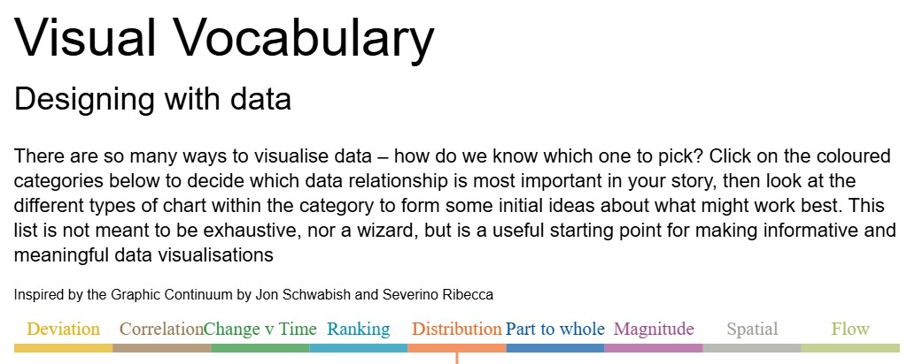
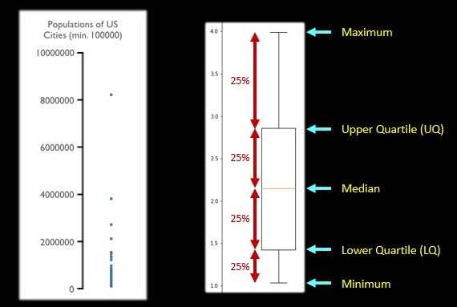
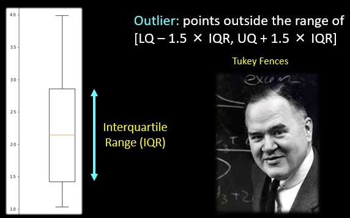

```{r}
#| label: setup
#| include: false
#| message: false
#| warning: false

library(tidyverse)
library(here)
library(knitr)
library(scales)
library(patchwork)

knitr::opts_chunk$set(dev = "ragg_png")

# CASA palette, used explicitly so the deck does not depend on casaviz
casa_purple <- "#4E3C56"
casa_teal   <- "#2E6260"
casa_yellow <- "#F9DD73"
casa_pink   <- "#E16FCA"
casa_green  <- "#9DBB65"
casa_cols   <- c("#2E6260", "#658E62", "#9DBB65", "#E7D870",
                 "#F3C486", "#E993AC", "#8F5289", "#4E3C56")

base_path <- here("sessions", "L6_data", "Performancetables_130242", "2022-2023")

# The DfE publishes suppressed / not-applicable values as codes, not blanks.
# We read them as NA here and return to what they mean later in the lecture.
na_all <- c("", "NA", "SUPP", "NP", "NE", "SP", "SN", "LOWCOV", "NEW", "SUPPMAT")

# Key Stage 4 outcomes: one row per school
ks4 <- read_csv(file.path(base_path, "england_ks4final.csv"),
                na = na_all, show_col_types = FALSE) |>
  mutate(URN = as.character(URN)) |>
  # The DfE files carry LA and national summary rows with no URN. They are not
  # schools, and because dplyr joins NA to NA they would also duplicate rows.
  filter(!is.na(URN)) |>
  select(URN, ATT8SCR, P8MEA, TOTPUPS, TPUP, NUMBOYS, NUMGIRLS,
         PTFSM6CLA1A, TFSM6CLA1A, PTPRIORLO) |>
  mutate(across(c(ATT8SCR, P8MEA, TOTPUPS, TPUP, NUMBOYS, NUMGIRLS,
                  PTFSM6CLA1A, TFSM6CLA1A, PTPRIORLO),
                ~ parse_number(as.character(.x))))

# Absence lives in a separate file, keyed on the same URN
absence <- read_csv(file.path(base_path, "england_abs.csv"),
                    na = na_all, show_col_types = FALSE) |>
  mutate(URN = as.character(URN)) |>
  filter(!is.na(URN)) |>
  distinct(URN, .keep_all = TRUE) |>
  select(URN, PERCTOT) |>
  mutate(PERCTOT = parse_number(as.character(PERCTOT)))

# School characteristics: every school in England, not just secondaries
school_info <- read_csv(file.path(base_path, "england_school_information.csv"),
                        na = na_all, show_col_types = FALSE) |>
  mutate(URN = as.character(URN)) |>
  select(URN, SCHNAME, LANAME, MINORGROUP, SCHOOLTYPE, GENDER,
         OFSTEDRATING, RELCHAR, ADMPOL, OFSTEDLASTINSP)

# Everything with a KS4 result, INCLUDING special and independent schools.
# Keeping them in is the point of several slides below.
schools_all <- ks4 |>
  left_join(school_info, by = "URN") |>
  left_join(absence, by = "URN") |>
  filter(!is.na(ATT8SCR)) |>
  # raw head-count of disadvantaged pupils, for the counts-vs-rates slide
  mutate(n_disadvantaged = round(TPUP * PTFSM6CLA1A / 100),
         # a genuine binary variable: single-sex or not
         single_sex = if_else(GENDER %in% c("Boys", "Girls"),
                              "Single sex", "Mixed"))

# Ofsted is ordinal: set the order once so every plot agrees
ofsted_order <- c("Special Measures", "Serious Weaknesses",
                  "Requires improvement", "Good", "Outstanding")

schools_all <- schools_all |>
  mutate(OFSTEDRATING = factor(OFSTEDRATING, levels = ofsted_order))

# Mainstream secondaries only - the subset used from week 6 onwards
schools_mainstream <- schools_all |>
  filter(MINORGROUP %in% c("Academy", "Maintained school"))
```

# This week

## Understanding and describing data

- Quantitative methods describe the range of mathematical and statistical techniques we can apply to data in order that we can derive meaning from it
- Data may arrive in many different forms
  -  spreadsheets of numbers
  -  pages of text
  -  ridges on a vinyl record
- Being able to identify the type of data you are dealing with will allow you to select the appropriate methods for making sense of it.

## Understanding and describing data

- Data may be gathered from a ***sample*** (e.g. the heights or eye colour of everyone in this room)
- Or a ***population*** (e.g. the heights or eye colour of everyone living in the UK right now)
- Samples may or may not be representative of the population they are drawn from (is the average height in this room a good representation of the average hight in the UK?)
- Knowing our data types and how to summarise and explore their qualities for a sample or a population, is the first step in building an understanding of this data

::: notes
This lecture focuses on understanding and describing data.

Everything this week uses the dataset we will keep coming back to all term, so
that by week 10 it is completely familiar.
:::

## Learning Objectives

By the end of this lecture you will:

1.  Understand the four basic levels of measurement, and the finer statistical
    data types that build on them;
2.  Consider how to summarise and represent data;
3.  Know the course dataset well enough to start asking questions of it.

# Our dataset for the term

## School performance in England, 2022/23 {.smaller}

::::: columns
::: {.column width="55%"}
- Published every year by the **Department for Education**
- A full census of every school in England — not a sample
- Hundreds of variables on attainment, pupil characteristics and school characteristics
- We will use it in almost every week of this course
:::

::: {.column width="45%"}
```{r}
#| label: dataset-size
#| echo: false

tibble(
  ` ` = c("Schools with a KS4 result",
          "Of which academies or maintained",
          "Variables in the full release",
          "Local authorities covered"),
  `Count` = c(comma(nrow(schools_all)),
              comma(nrow(schools_mainstream)),
              "700+",
              comma(n_distinct(schools_all$LANAME)))
) |>
  kable(align = "lr")
```
:::
:::::

::: footer
DfE: <https://www.compare-school-performance.service.gov.uk/download-data>
:::

## What a row actually looks like {.smaller}

```{r}
#| label: dataset-peek
#| echo: false

schools_all |>
  filter(LANAME == "Brighton and Hove", MINORGROUP == "Academy") |>
  select(SCHNAME, MINORGROUP, OFSTEDRATING, TOTPUPS, ATT8SCR, PTFSM6CLA1A) |>
  arrange(desc(ATT8SCR)) |>
  head(6) |>
  kable(
    col.names = c("School", "Type", "Ofsted", "Pupils",
                  "Attainment 8", "% disadvantaged"),
    digits = 1
  )
```

- Every row is a **school**. Remember that — it matters later.
- We are never looking at individual pupils in this dataset.

::: {.notes}
Stress the unit of observation. Almost every mistake students make with this
data comes from forgetting that a row is a school, not a child.
:::

## Attainment 8 — our main outcome variable

- Sums each pupil's grades across **8 GCSEs**
- Maths counted twice, English often twice
- Maximum possible score is **90**; 40 is roughly a "standard pass" average
- Averaged across all Year 11 pupils to give a **school-level** score

. . .

It is a *raw* score. It takes no account of who a school admits — which is
exactly the problem we spend weeks 6 to 8 solving.

# Data types

## Four levels of measurements

|                          | Nominal | Ordinal | Interval | Ratio |
|--------------------------|:-------:|:-------:|:--------:|:-----:|
| Categorizes and labels variables | ✔ | ✔ | ✔ | ✔ |
| Ranks categories in order        |   | ✔ | ✔ | ✔ |
| Has known, equal intervals       |   |   | ✔ | ✔ |
| Has a true or meaningful zero    |   |   |   | ✔ |

- Developed by psychologist Stanley Smith Stevens (1906 - 1973)

. . .

This is the classic starting point, and it is where most courses stop. 
We will start with this - but then go a little further later in the lecture

## Nominal {.smaller}

::::: columns
::: {.column width="42%"}
- Differentiates items based only on names; no order between them
- Also called **categorical data**
- What can be said about them?
  - *Equality*: an Academy is not a Special school
  - *Mode*: the most common category

*In our data:* school type, religious character, region, admissions policy.
:::

::: {.column width="58%"}
```{r}
#| label: nominal-plot
#| echo: false
#| fig-width: 5.6
#| fig-height: 4.2

schools_all |>
  count(MINORGROUP) |>
  mutate(MINORGROUP = fct_reorder(replace_na(MINORGROUP, "Unknown"), n)) |>
  ggplot(aes(x = n, y = MINORGROUP)) +
  geom_col(fill = casa_purple, alpha = 0.85) +
  geom_text(aes(label = comma(n)), hjust = -0.15, size = 3) +
  scale_x_continuous(expand = expansion(mult = c(0, 0.2)), labels = comma) +
  labs(x = "Number of schools", y = NULL) +
  theme_minimal(base_size = 10)
```

[The bars can be reordered freely — there is no natural order here]{style="font-size:0.7em;"}
:::
:::::

## Ordinal {.smaller}

::::: columns
::: {.column width="42%"}
- Allow for rank order, but not the relative degree of difference
- What can be said about them?
  - :white_check_mark: Equality; mode
  - :white_check_mark: Median: middle-ranked item
  - :x: Differences between two levels; arithmetic mean

*In our data:* **Ofsted rating**.
:::

::: {.column width="58%"}
```{r}
#| label: ordinal-plot
#| echo: false
#| fig-width: 5.6
#| fig-height: 4.2

schools_all |>
  filter(!is.na(OFSTEDRATING)) |>
  count(OFSTEDRATING) |>
  ggplot(aes(x = OFSTEDRATING, y = n)) +
  geom_col(fill = casa_teal, alpha = 0.85) +
  geom_text(aes(label = comma(n)), vjust = -0.4, size = 3) +
  scale_y_continuous(expand = expansion(mult = c(0, 0.15)), labels = comma) +
  labs(x = NULL, y = "Number of schools") +
  theme_minimal(base_size = 10) +
  theme(axis.text.x = element_text(angle = 30, hjust = 1))
```

[The order cannot be shuffled — but is Good → Outstanding the same size a step as Requires improvement → Good?]{style="font-size:0.7em;"}
:::
:::::

## Interval and ratio

**Interval** — differences are meaningful, but the **zero is arbitrary**

- 100°C is **not** twice as hot as 50°C
- *In our data:* the **date of the last Ofsted inspection**. 2015 → 2018 is the same gap as 2018 → 2021, but "year zero" is a convention.

. . .

**Ratio** — a true, non-arbitrary zero, so ratios are meaningful

- :white_check_mark: Equality, mode, median, arithmetic mean, **and ratio**
- *In our data:* **pupils on roll**, **Attainment 8**, **% disadvantaged**. A
  school with 1,200 pupils really does have twice as many as one with 600.

## A zero is not enough: Progress 8 {.smaller}

::::: columns
::: {.column width="40%"}
**Progress 8** compares the progress pupils made with similar pupils nationally.

- Zero means "average expected progress"
- Positive is more, negative is less

. . .

The zero is **meaningful**. So is it ratio data?

. . .

**No.** King's scores 0.57 and Blatchington Mill 0.03 — a ratio of **19:1**.
Nobody would claim 19 times the progress. And Longhill is **negative**, so no
ratio is possible at all.
:::

::: {.column width="60%"}
```{r}
#| label: p8-ratio
#| echo: false
#| message: false
#| warning: false
#| fig-width: 6
#| fig-height: 4.6

btn <- schools_mainstream |>
  filter(LANAME == "Brighton and Hove", !is.na(P8MEA), !is.na(ATT8SCR)) |>
  mutate(SCHNAME = str_trunc(SCHNAME, 26),
         SCHNAME = fct_reorder(SCHNAME, P8MEA))

p_att <- ggplot(btn, aes(x = ATT8SCR, y = SCHNAME)) +
  geom_col(fill = casa_teal, alpha = 0.85) +
  scale_x_continuous(limits = c(0, 60), expand = expansion(mult = c(0, 0.05))) +
  labs(title = "Attainment 8 — ratio", subtitle = "zero is a real floor: no marks at all",
       x = NULL, y = NULL) +
  theme_minimal(base_size = 9)

p_p8 <- ggplot(btn, aes(x = P8MEA, y = SCHNAME)) +
  geom_col(aes(fill = P8MEA > 0), alpha = 0.85, show.legend = FALSE) +
  geom_vline(xintercept = 0, colour = "black", linewidth = 0.6) +
  scale_fill_manual(values = c(`TRUE` = casa_purple, `FALSE` = casa_pink)) +
  labs(title = "Progress 8 — interval", subtitle = "zero sits mid-scale: average progress",
       x = NULL, y = NULL) +
  theme_minimal(base_size = 9) +
  theme(axis.text.y = element_blank())

patchwork::wrap_plots(p_att, p_p8, nrow = 1, widths = c(1.35, 1))
```
:::
:::::

::: {.notes}
Same ten Brighton schools on both panels. Left: bars start at a true zero, so
"school A has 1.1 times the attainment of school B" is a sensible sentence.
Right: bars straddle zero, so the same sentence is meaningless.

This is the slide that stops students assuming "has a zero" means "ratio".
P8MEA appears again later under real-valued additive, where its symmetry
rather than its zero is the point.
:::

# A finer-grained decomposition

## Why four levels are not enough

Stevens tells us which **operations** are permitted. It does not tell us which
**distribution** a variable follows, or which **model** to fit.

. . .

Take two variables from our data. Both are on a **ratio** scale — both have a
true zero, both support ratios:

| | Pupils on roll | % of sessions missed |
|---|---|---|
| Values | whole numbers | continuous |
| Can be negative? | no | no |
| Upper limit | none in principle | 100 |
| Typical value | ~1,050 | ~9 |

. . .

Stevens says these are the same kind of thing. Let's look at them.

## What is a distribution?{.smaller}

::: {style="font-size:0.8em;"}
A **distribution** is just the answer to "how are the values spread out?" —
how many observations fall where.
:::

```{r}
#| label: what-is-a-distribution
#| echo: false
#| message: false
#| warning: false
#| fig-width: 11
#| fig-height: 3.7
#| fig-align: center

dpl <- schools_mainstream |> filter(!is.na(TOTPUPS))

set.seed(1)
d1 <- ggplot(dpl, aes(x = TOTPUPS, y = runif(nrow(dpl)))) +
  geom_point(alpha = 0.12, colour = casa_purple, size = 0.7) +
  labs(title = "1. Every school is a point", x = "Pupils on roll", y = NULL) +
  theme_minimal(base_size = 12) +
  theme(axis.text.y = element_blank(), panel.grid.major.y = element_blank())

d2 <- ggplot(dpl, aes(x = TOTPUPS)) +
  geom_histogram(bins = 35, fill = casa_purple, alpha = 0.7) +
  labs(title = "2. Count them into bins", x = "Pupils on roll", y = "Schools") +
  theme_minimal(base_size = 12)

d3 <- ggplot(dpl, aes(x = TOTPUPS)) +
  geom_histogram(aes(y = after_stat(density)), bins = 35,
                 fill = casa_purple, alpha = 0.35) +
  geom_density(colour = casa_pink, linewidth = 1) +
  labs(title = "3. That shape is the distribution", x = "Pupils on roll",
       y = "Density") +
  theme_minimal(base_size = 12) +
  theme(axis.text.y = element_blank())

patchwork::wrap_plots(d1, d2, d3, nrow = 1)
```

::: {.incremental}
- The **histogram** is the workhorse: bin the values, count how many land in each bin
- The smooth curve is the same information with the bins taken away
- Almost everything else in this course starts by asking what shape a variable has
:::

## Two ratio variables, two different shapes {.smaller}

```{r}
#| label: two-shapes
#| echo: false
#| message: false
#| warning: false
#| fig-width: 10
#| fig-height: 4.0
#| fig-align: center

two <- schools_mainstream |> filter(!is.na(TOTPUPS), !is.na(PERCTOT))
skw <- function(x) mean((x - mean(x))^3) / sd(x)^3

t1 <- ggplot(two, aes(x = TOTPUPS)) +
  geom_histogram(aes(y = after_stat(density)), bins = 35,
                 fill = casa_purple, alpha = 0.4) +
  geom_density(colour = casa_purple, linewidth = 1) +
  labs(title = paste0("Pupils on roll  (skew ", sprintf("%.2f", skw(two$TOTPUPS)), ")"),
       x = NULL, y = "Density") +
  theme_minimal(base_size = 13) + theme(axis.text.y = element_blank())

t2 <- ggplot(two, aes(x = PERCTOT)) +
  geom_histogram(aes(y = after_stat(density)), bins = 35,
                 fill = casa_teal, alpha = 0.4) +
  geom_density(colour = casa_teal, linewidth = 1) +
  labs(title = paste0("% sessions missed  (skew ", sprintf("%.2f", skw(two$PERCTOT)), ")"),
       x = NULL, y = NULL) +
  theme_minimal(base_size = 13) + theme(axis.text.y = element_blank())

patchwork::wrap_plots(t1, t2, nrow = 1)
```

::: {.incremental}
- Left: roughly symmetric, a lump in the middle with tails either side
- Right: a hard floor near zero and a long tail to the right — **skewed**
- **Skew** measures that asymmetry: 0 is symmetric, positive means a right tail
:::

. . .

Same level of measurement. Different shapes, different distributions, and
different models. Stevens cannot see the difference — so we need something
more specific.

## Simple statistical data types {.smaller}

| Data type | Possible values | Level of measurement | Common distributions | Common model |
|-----------|-----------------|:--------------------:|----------------------|--------------|
| **binary** | 0, 1 | nominal | Bernoulli | logistic, probit |
| **categorical** | "name1" … "nameK" | nominal | categorical | multinomial logit / probit |
| **ordinal** | ordered categories | ordinal | categorical | ordered logit / probit |
| **binomial** | 0, 1, …, N | interval | binomial, beta-binomial | binomial regression |
| **real-valued additive** | any real number | interval | normal — symmetric | standard linear regression |
| **count** | 0, 1, 2, … | ratio | Poisson, negative binomial | Poisson / neg. binomial regression |
| **real-valued multiplicative** | positive real | ratio | log-normal, gamma, exponential — skewed | GLM with a logarithmic link |

[Adapted from [Statistical data type](https://en.wikipedia.org/wiki/Statistical_data_type), Wikipedia (CC BY-SA)]{style="font-size:0.5em; color:#666;"}

::: {.notes}
The two columns worth dwelling on are the last two. The whole point of this
table is that the data type determines the distribution, and the distribution
determines the model. Everything in weeks 5 to 10 is an instance of this.
:::

## Every one of these is in our dataset {.smaller}

```{r}
#| label: types-mapping
#| echo: false

tibble(
  `Data type` = c("binary", "categorical", "ordinal", "binomial",
                  "real-valued additive", "count", "real-valued multiplicative"),
  `Variable` = c("single sex / mixed", "MINORGROUP", "OFSTEDRATING",
                 "TFSM6CLA1A out of TPUP", "P8MEA", "TOTPUPS", "PERCTOT"),
  `What it is` = c("Is the school single sex?",
                   "School type",
                   "Ofsted rating",
                   "Disadvantaged pupils out of the cohort",
                   "Progress 8",
                   "Pupils on roll",
                   "% of sessions missed")
) |>
  kable(align = "lll")
```

We will meet the model in the right-hand column of the previous slide for
almost all of these before the course ends.

## Binary

```{r}
#| label: type-binary
#| echo: false
#| fig-width: 9
#| fig-height: 3.4
#| fig-align: center

schools_all |>
  filter(!is.na(single_sex)) |>
  count(single_sex) |>
  ggplot(aes(x = n, y = single_sex)) +
  geom_col(fill = casa_teal, alpha = 0.85) +
  geom_text(aes(label = comma(n)), hjust = -0.15, size = 4) +
  scale_x_continuous(expand = expansion(mult = c(0, 0.15)), labels = comma) +
  labs(x = "Number of schools", y = NULL) +
  theme_minimal(base_size = 12)
```

- Exactly two outcomes, so the whole variable is described by **one number**: the proportion
- Distribution: **Bernoulli**
- If this were the thing we wanted to *predict*, we would need **logistic regression**

## Count

```{r}
#| label: type-count
#| echo: false
#| fig-width: 9
#| fig-height: 3.6
#| fig-align: center

schools_mainstream |>
  filter(!is.na(TOTPUPS)) |>
  ggplot(aes(x = TOTPUPS)) +
  geom_histogram(bins = 40, fill = casa_purple, alpha = 0.7) +
  scale_y_continuous(expand = expansion(mult = c(0, 0.08))) +
  labs(x = "Pupils on roll", y = "Schools") +
  theme_minimal(base_size = 12)
```

- Whole numbers, never negative, no upper limit in principle
- A mean of `r sprintf("%.0f", mean(schools_mainstream$TOTPUPS, na.rm = TRUE))` pupils is meaningful; a school with 1,204.7 pupils is not
- Distribution: **Poisson** or **negative binomial**, not normal

## Binomial

```{r}
#| label: type-binomial
#| echo: false
#| fig-width: 9
#| fig-height: 3.6
#| fig-align: center

schools_mainstream |>
  filter(!is.na(TFSM6CLA1A), !is.na(TPUP), TPUP > 0) |>
  ggplot(aes(x = TPUP, y = TFSM6CLA1A)) +
  geom_abline(slope = 1, intercept = 0, linetype = "dashed", colour = "grey60") +
  geom_point(alpha = 0.2, colour = casa_teal, size = 1) +
  labs(x = "Pupils in the cohort (N)",
       y = "Disadvantaged pupils (successes)") +
  theme_minimal(base_size = 12)
```

- A count **bounded above** by the size of the cohort — it cannot exceed an upper ceiling - **N**
- The dashed line is the ceiling: where every pupil would be disadvantaged
- Distribution: **binomial**. This is why a percentage is the natural summary.

## Negative binomial {.smaller}

::::: columns
::: {.column width="45%"}
The name is misleading — it is **not** the opposite of binomial.

- **Binomial:** fix the number of trials, count the successes. Bounded by N.
- **Negative binomial:** fix the number of successes, count the trials needed. **Unbounded.**

So it produces a *count*, which is why the taxonomy lists it beside Poisson
rather than beside binomial.

. . .

**Why you actually meet it.** Poisson assumes the variance *equals* the mean.

Disadvantaged pupils per school: mean **`r sprintf("%.1f", mean(schools_mainstream$TFSM6CLA1A, na.rm = TRUE))`**,
variance **`r sprintf("%.0f", var(schools_mainstream$TFSM6CLA1A, na.rm = TRUE))`** — a ratio of
**`r sprintf("%.0f", var(schools_mainstream$TFSM6CLA1A, na.rm = TRUE) / mean(schools_mainstream$TFSM6CLA1A, na.rm = TRUE))`:1**
where Poisson demands 1:1. That is **overdispersion**, and it is the norm.
:::

::: {.column width="55%"}
```{r}
#| label: negbin
#| echo: false
#| message: false
#| warning: false
#| fig-width: 5.8
#| fig-height: 3.9

nb <- schools_mainstream |> filter(!is.na(TFSM6CLA1A))
set.seed(1)
cmp <- bind_rows(
  tibble(value = nb$TFSM6CLA1A,                        src = "What we observe"),
  tibble(value = rpois(nrow(nb), mean(nb$TFSM6CLA1A)), src = "If it were Poisson")
)

ggplot(cmp, aes(x = value, fill = src)) +
  geom_histogram(bins = 45, alpha = 0.65, position = "identity") +
  scale_fill_manual(values = c("What we observe" = casa_teal,
                               "If it were Poisson" = casa_pink)) +
  labs(x = "Disadvantaged pupils per school", y = "Schools", fill = NULL) +
  theme_minimal(base_size = 11) +
  theme(legend.position = "bottom")
```
:::
:::::

::: {.notes}
The pink histogram is a genuine Poisson draw with the same mean. If these
counts were Poisson, every school in England would have between roughly 22 and
73 disadvantaged pupils. The real range is 0 to 263.

The negative binomial adds a second parameter that lets the variance exceed
the mean, which is why it is the usual fallback for count regression.
:::

## Real-valued additive

```{r}
#| label: type-additive
#| echo: false
#| fig-width: 9
#| fig-height: 3.4
#| fig-align: center

p8 <- schools_mainstream |> filter(!is.na(P8MEA))

ggplot(p8, aes(x = P8MEA)) +
  geom_histogram(bins = 50, fill = casa_purple, alpha = 0.65) +
  geom_vline(xintercept = mean(p8$P8MEA), colour = casa_pink, linewidth = 1) +
  scale_y_continuous(expand = expansion(mult = c(0, 0.08))) +
  labs(x = "Progress 8", y = "Schools") +
  theme_minimal(base_size = 12)
```

- A real number can be placed anywhere on a line - i.e. can have a decimal
- Can be **negative**. Symmetric about its mean.
- Mean `r sprintf("%.3f", mean(p8$P8MEA))`, median `r sprintf("%.3f", median(p8$P8MEA))` — almost identical
- Distribution: **normal**. Model: **ordinary linear regression** — weeks 6 and 7.

## Real-valued multiplicative {.smaller}

```{r}
#| label: type-multiplicative
#| echo: false
#| message: false
#| warning: false
#| fig-width: 10
#| fig-height: 3.6
#| fig-align: center

abs_pos <- schools_mainstream |> filter(!is.na(PERCTOT), PERCTOT > 0)
sk <- function(x) mean((x - mean(x))^3) / sd(x)^3

p_raw <- ggplot(abs_pos, aes(x = PERCTOT)) +
  geom_histogram(bins = 40, fill = casa_purple, alpha = 0.65) +
  labs(title = paste0("As published  (skew = ", sprintf("%.2f", sk(abs_pos$PERCTOT)), ")"),
       x = "% sessions missed", y = "Schools") +
  theme_minimal(base_size = 11)

p_log <- ggplot(abs_pos, aes(x = log(PERCTOT))) +
  geom_histogram(bins = 40, fill = casa_teal, alpha = 0.65) +
  labs(title = paste0("Logged  (skew = ", sprintf("%.2f", sk(log(abs_pos$PERCTOT))), ")"),
       x = "log(% sessions missed)", y = "Schools") +
  theme_minimal(base_size = 11)

patchwork::wrap_plots(p_raw, p_log, nrow = 1)
```

- Strictly positive, and **skewed** — a long tail of high-absence schools
- Taking the logarithm makes it very nearly symmetric
- This is not a trick. It is what the data type tells us to do — and it is
  exactly what we do in **week 6** when we fit a log-log model.

## Why any of this matters {.smaller}

| If your outcome is… | …the model you need is | Covered in |
|---------------------|------------------------|------------|
| real-valued additive | linear regression | weeks 6, 7 |
| real-valued multiplicative | linear regression on logged data | weeks 6, 7 |
| grouped / nested | linear mixed effects | week 8 |
| binary | logistic regression | not covered — but you will meet it |
| count | Poisson regression | not covered — but you will meet it |

. . .

**Choosing the wrong one does not usually throw an error.** It quietly gives
you a plausible, wrong answer. Knowing your data type is the defence.

## Statistical types and programming types {.smaller}

| Statistical type | Programming type | In R | In Python / pandas |
|------------------|------------------|------|--------------------|
| real-valued (interval or ratio) | floating point | `numeric` / `double` | `float64` |
| count | integer | `integer` | `int64` |
| binary | Boolean | `logical` | `bool` |
| categorical | enumerated type | `factor` | `category` |
| ordinal | ordered enumerated type | `ordered factor` | `Categorical(ordered=True)` |
| random vector | list or array | `vector` | `ndarray` / `Series` |
| random matrix | two-dimensional array | `matrix` | 2-D `ndarray` |

[Left two columns adapted from [Statistical data type](https://en.wikipedia.org/wiki/Statistical_data_type), Wikipedia (CC BY-SA)]{style="font-size:0.5em; color:#666;"}

## Encoding does not change the measurement

- Ofsted rating is ORDINAL
- If we store it as {Special Measures:1, ..., Outstanding:5}, is it ORDINAL, or INTERVAL?

. . .

Still ordinal. Storing something as a number does not make the gaps equal.

## ...and this is a common analysis error

::: {.incremental}
- Categorical or ordinal data often arrives **already coded as numbers**
- Software cannot tell. `read_csv` sees 1, 2, 3, 4, 5 and hands you a numeric column
- **Nothing errors.** Every summary works. Every model runs.
- So people put it into a regression as a continuous predictor and report
  "each additional unit of Ofsted is worth *x* points"
:::

. . .

That claim assumes every step on the scale is the same size. Let's check.

## What the data says about those steps {.smaller}

```{r}
#| label: ordinal-as-numeric
#| echo: false
#| message: false
#| warning: false

ofs <- schools_mainstream |>
  filter(!is.na(OFSTEDRATING), !is.na(ATT8SCR)) |>
  mutate(ofsted_n = as.numeric(OFSTEDRATING))

step_tbl <- ofs |>
  group_by(OFSTEDRATING) |>
  summarise(n = n(), mean_att8 = mean(ATT8SCR), .groups = "drop") |>
  mutate(step = c(NA, diff(mean_att8)))

slope <- coef(lm(ATT8SCR ~ ofsted_n, data = ofs))[2]

step_tbl |>
  transmute(
    `Ofsted rating` = as.character(OFSTEDRATING),
    Schools = comma(n),
    `Mean Attainment 8` = sprintf("%.1f", mean_att8),
    `Step up from the one below` = if_else(is.na(step), "—", sprintf("%+.2f", step))
  ) |>
  kable(align = "lrrr")
```

::: {.incremental}
- Treated as a number, the model says every step is worth **`r sprintf("%.2f", slope)`** points
- The real steps run from **+0.07** to **+11.79** — the middle one is essentially nothing
- The software will also happily tell you the mean Ofsted rating is
  **`r sprintf("%.2f", mean(ofs$ofsted_n))`**, which is not a rating
:::

::: {.notes}
The fix is to enter it as a factor, so the model estimates each level
separately. Exactly what weeks 6 to 8 do with school type and region.

Note we are excluding the 21 "Inadequate" schools here, as the rest of this
deck does, because that label sits outside the five-point scale used above.
:::

## Getting the type wrong, in code

We said earlier that Ofsted rating is ordinal. Here is what happens if your
**code** does not know that:

::: {.incremental}
- Read it as plain text and R orders it **alphabetically** — Good, Inadequate, Outstanding, Requires improvement
- That is not a ranking, it is the alphabet
- Store it as an **ordered factor** and every table, plot and model respects the real order
- We set exactly this up in the code behind these slides
:::

::: {.notes}
Tie back to the Ofsted plot earlier in the lecture, which only came out in a
sensible order because OFSTEDRATING was converted to an ordered factor in the
setup chunk.
:::

## Quiz time

::: {.notes}
Mentimeter quiz — classify a handful of DfE variables by level of measurement.
Suggested items: TOTPUPS, OFSTEDRATING, LANAME, ATT8SCR, P8MEA, OFSTEDLASTINSP.
:::

# How do you describe a ratio variable?

## Key metrics
:::: {.columns}

::: {.column width="50%"}

::: {.incremental}
- Quantity
- The middle
- The spread
:::

:::

::::

## Attainment 8 across all English schools {.smaller}

```{r}
#| label: att8-summary
#| echo: false

schools_all |>
  summarise(
    `Schools (n)` = comma(n()),
    `Mean`        = sprintf("%.1f", mean(ATT8SCR)),
    `Median`      = sprintf("%.1f", median(ATT8SCR)),
    `Std. dev.`   = sprintf("%.1f", sd(ATT8SCR)),
    `Minimum`     = sprintf("%.1f", min(ATT8SCR)),
    `Maximum`     = sprintf("%.1f", max(ATT8SCR))
  ) |>
  kable(align = "r")
```

::: {.incremental}
- Quantity: `r comma(nrow(schools_all))` schools
- The middle: mean `r sprintf("%.1f", mean(schools_all$ATT8SCR))`, median `r sprintf("%.1f", median(schools_all$ATT8SCR))`
- **The mean is *lower* than the median.** Why?
:::

::: {.notes}
Do not resolve this yet — it is the hook for the visualisation section.
:::

## Mean, median, mode

- **Mean** — add everything up, divide by how many
- **Median** — line them all up, take the middle one
- **Mode** — the most common value

. . .

For Attainment 8 the mode is close to useless: scores are near-continuous, so
almost every school has its own value. Reporting it would be a mistake.

## The middle is not enough

```{r}
#| label: same-mean-diff-spread
#| echo: false
#| message: false
#| warning: false
#| fig-width: 9
#| fig-height: 3.9
#| fig-align: center

pair <- schools_all |>
  filter(MINORGROUP %in% c("Academy", "Maintained school"))

pair_stats <- pair |>
  group_by(MINORGROUP) |>
  summarise(n = n(), mean = mean(ATT8SCR), sd = sd(ATT8SCR), .groups = "drop")

ggplot(pair, aes(x = MINORGROUP, y = ATT8SCR, fill = MINORGROUP)) +
  geom_violin(scale = "count", alpha = 0.45, colour = NA) +
  geom_boxplot(width = 0.10, outlier.size = 0.5, outlier.alpha = 0.35,
               fill = "white", alpha = 0.9) +
  geom_point(data = pair_stats, aes(x = MINORGROUP, y = mean),
             inherit.aes = FALSE, colour = casa_pink, size = 3) +
  geom_text(data = pair_stats,
            aes(x = MINORGROUP, y = 5,
                label = paste0("n = ", comma(n),
                               "
mean = ", sprintf("%.2f", mean),
                               "
sd = ", sprintf("%.2f", sd))),
            inherit.aes = FALSE, size = 3.2, colour = "grey25") +
  scale_fill_manual(values = c(casa_purple, casa_teal), guide = "none") +
  coord_flip() +
  labs(x = NULL, y = "Attainment 8") +
  theme_minimal(base_size = 12)
```

::: {.incremental}
- The two means differ by **0.04 of a point** — for practical purposes, identical
- The **spread** does not: academies are noticeably wider
- Report only the mean and these two look like the same story. They are not.
:::

## Variance and standard deviation {.smaller}

::::: columns
::: {.column width="52%"}
**Variance** is the average squared distance from the mean:

$$\sigma^2 = \frac{\sum_{i=1}^{n} (y_i - \bar{y})^2}{n}$$

**Standard deviation** is its square root:

$$\sigma = \sqrt{\sigma^2}$$

. . .

Squaring is what makes variance awkward to talk about: if $y$ is in GCSE
points, the variance is in **points²**. The standard deviation is back in
points, which is why we almost always report that instead.
:::

::: {.column width="48%"}
```{r}
#| label: var-sd-table
#| echo: false

schools_all |>
  filter(MINORGROUP %in% c("Academy", "Maintained school")) |>
  group_by(`School type` = MINORGROUP) |>
  summarise(
    Mean       = sprintf("%.2f", mean(ATT8SCR)),
    `Variance` = sprintf("%.0f", var(ATT8SCR)),
    `Std dev`  = sprintf("%.2f", sd(ATT8SCR)),
    .groups = "drop"
  ) |>
  kable(align = "lrrr")
```

[Same mean. The variance of academy scores is close to half again as large.]{style="font-size:0.75em;"}

[Squaring also means **outliers count heavily** — a school 30 points from the mean contributes 900, not 30.]{style="font-size:0.75em;"}
:::
:::::

## Spread across all four school types

```{r}
#| label: spread-all-types
#| echo: false
#| message: false
#| warning: false
#| fig-width: 10
#| fig-height: 4.3
#| fig-align: center

types <- schools_all |>
  filter(MINORGROUP %in% c("Academy", "Maintained school",
                           "Independent school", "Special school")) |>
  mutate(MINORGROUP = fct_reorder(MINORGROUP, ATT8SCR, .fun = median))

type_lab <- types |>
  group_by(MINORGROUP) |>
  summarise(n = n(), sd = sd(ATT8SCR), .groups = "drop")

ggplot(types, aes(x = MINORGROUP, y = ATT8SCR, fill = MINORGROUP)) +
  geom_violin(scale = "count", alpha = 0.45, colour = NA) +
  geom_boxplot(width = 0.11, outlier.size = 0.5, outlier.alpha = 0.35,
               fill = "white", alpha = 0.9) +
  geom_text(data = type_lab,
            aes(x = MINORGROUP, y = -7,
                label = paste0("n = ", comma(n), "   sd = ", sprintf("%.1f", sd))),
            inherit.aes = FALSE, size = 3.1, colour = "grey25") +
  scale_fill_manual(values = c(casa_teal, casa_green, casa_pink, casa_purple),
                    guide = "none") +
  labs(x = NULL, y = "Attainment 8") +
  theme_minimal(base_size = 12)
```

::: {.incremental}
- The **box** gives you the median, the quartiles and the outliers
- The **width of the violin** is proportional to how many schools are in that group — a boxplot alone would hide that
- Independent schools: widest spread by far (sd 18.9), and the only group where the box spans more than 30 points
:::

## Summary of key metrics
:::: {.columns}

::: {.incremental}
- Quantity
- The middle: mean, median, mode
- The spread: variance, standard deviation
- *Visualising data is also important*: BOXPLOT!
- *Please check two types of SPECIAL VALUES before computing these metrics.*
:::

::::

# Visualising data
{style="max-width:70%; max-height:70%; margin:auto;"}

## FT visual vocabulary
- https://ft-interactive.github.io/visual-vocabulary/
{style="max-width:90%; max-height:90%; margin:auto;"}

## So why is the mean below the median?

```{r}
#| label: att8-hist-all
#| echo: false
#| fig-width: 10
#| fig-height: 4.6
#| fig-align: center

mean_all   <- mean(schools_all$ATT8SCR)
median_all <- median(schools_all$ATT8SCR)

ggplot(schools_all, aes(x = ATT8SCR)) +
  geom_histogram(binwidth = 1, fill = casa_purple, alpha = 0.55) +
  geom_vline(xintercept = median_all, colour = "black",
             linetype = "dotted", linewidth = 1) +
  geom_vline(xintercept = mean_all, colour = casa_yellow, linewidth = 1) +
  annotate("text", x = median_all, y = Inf,
           label = paste0("Median = ", round(median_all, 1)),
           hjust = -0.05, vjust = 2, size = 4) +
  annotate("text", x = mean_all, y = Inf,
           label = paste0("Mean = ", round(mean_all, 1)),
           hjust = 1.05, vjust = 2, size = 4, colour = "#B89B10") +
  scale_y_continuous(expand = expansion(mult = c(0, 0.08))) +
  labs(title = "Attainment 8, all English schools with a KS4 result, 2022/23",
       x = "Average Attainment 8 score", y = "Number of schools") +
  theme_minimal(base_size = 13)
```

- One summary table told us mean < median. **One picture tells us why.**
- There is a whole second population of schools down at the left.

## The same data, split by school type

```{r}
#| label: att8-hist-bytype
#| echo: false
#| fig-width: 10
#| fig-height: 4.6
#| fig-align: center

schools_all |>
  mutate(MINORGROUP = replace_na(MINORGROUP, "Unknown")) |>
  ggplot(aes(x = ATT8SCR, fill = MINORGROUP)) +
  geom_histogram(binwidth = 1, alpha = 0.85, position = "stack") +
  scale_fill_manual(values = casa_cols) +
  scale_y_continuous(expand = expansion(mult = c(0, 0.08))) +
  labs(title = "The left-hand hump is special schools",
       x = "Average Attainment 8 score", y = "Number of schools",
       fill = "School type") +
  theme_minimal(base_size = 13) +
  theme(legend.position = "bottom")
```

- **Special schools** educate pupils with significant special educational needs
- Attainment 8 was never designed to compare them with mainstream schools

## What that does to the headline number {.smaller}

```{r}
#| label: att8-bytype-table
#| echo: false

schools_all |>
  mutate(MINORGROUP = replace_na(MINORGROUP, "Unknown")) |>
  group_by(`School type` = MINORGROUP) |>
  summarise(
    n        = n(),
    Mean     = round(mean(ATT8SCR), 1),
    Median   = round(median(ATT8SCR), 1),
    `Std dev` = round(sd(ATT8SCR), 1),
    .groups = "drop"
  ) |>
  arrange(Mean) |>
  kable(align = "lrrrr")
```

::: {.incremental}
- Mixing these together produces a mean that describes **no real school**
- The fix is not statistical, it is *knowing what is in your data*
- From week 6 onwards we work with mainstream secondaries only — now you know why
:::

## Boxplot for a dataset
- Showing distribution of a dataset

{style="width:70%; height:70%;"}

## Boxplot for comparing multiple datasets

```{r}
#| label: att8-boxplot
#| echo: false
#| fig-width: 10
#| fig-height: 4.8
#| fig-align: center

schools_all |>
  mutate(MINORGROUP = replace_na(MINORGROUP, "Unknown"),
         MINORGROUP = fct_reorder(MINORGROUP, ATT8SCR, .fun = median)) |>
  ggplot(aes(x = ATT8SCR, y = MINORGROUP, fill = MINORGROUP)) +
  geom_boxplot(alpha = 0.6, outlier.alpha = 0.25, outlier.size = 0.8) +
  scale_fill_manual(values = casa_cols, guide = "none") +
  labs(title = "Attainment 8 by school type",
       x = "Average Attainment 8 score", y = NULL) +
  theme_minimal(base_size = 13)
```

- Side-by-side boxplots make the comparison immediate
- Note how much **wider** the special school box is — not just lower

## When boxplot fails?
- When there are lots of 'outliers' in the data
- What are 'Outliers'?

# Special values: null and outliers

## *Null* values
- Representing the absence of data or an unknown value
- Different from *zero* or *a blank space*
- Null values should be excluded before computing mean or std

## Missing data is a decision someone made {.smaller}

The DfE does not leave blanks — it publishes **codes**:

| Code | Meaning |
|------|---------|
| `SUPP` | Suppressed, because the number of pupils is too small to publish safely |
| `NP` | Not published |
| `NE` | No entries |
| `LOWCOV` | Low coverage — too few pupils for a reliable figure |
| `NEW` | School too new to have results |

. . .

`SUPP` is **disclosure control**, not an error. A missing value here tells you
the school is small — which is information, and it is not missing at random.

::: {.notes}
This is the single most useful practical thing in the lecture. It is also
exactly what the na_values list in the practicals is doing.
:::

## How much is missing? {.smaller}

```{r}
#| label: missingness
#| echo: false

schools_all |>
  summarise(
    `Attainment 8`      = mean(is.na(ATT8SCR)),
    `Progress 8`        = mean(is.na(P8MEA)),
    `Pupils on roll`    = mean(is.na(TOTPUPS)),
    `% disadvantaged`   = mean(is.na(PTFSM6CLA1A)),
    `Ofsted rating`     = mean(is.na(OFSTEDRATING)),
    `Overall absence`   = mean(is.na(PERCTOT))
  ) |>
  pivot_longer(everything(), names_to = "Variable", values_to = "share") |>
  mutate(`Missing` = percent(share, accuracy = 0.1)) |>
  select(Variable, Missing) |>
  kable(align = "lr")
```

- Always check this **before** you compute anything
- And ask *why* each one is missing, not just how many

## Null island in geography
- long=0, lat=0. Not even an island!
- It became famous because some software assigned "0,0" for long-lat when location is missing
- Many events were mapped to this one, including lots on Strava
- Source: wikipedia.org

:::: {.columns}
::: {.column width="50%"}
{height=300px}
:::
::: {.column width="50%"}
{height=300px}
:::
::::

## Outliers
- A data point that differs significantly from other observations
- There are three types of outliers
- Please explain the rationale for removing any identified outliers, including the criteria and methods used

## Three types of outlier {.smaller}

| Type | Source | Handling |
| ---- | ------ | -------- |
| **Error Outliers** | Mistakes in collection, entry or measurement — e.g. a temperature sensor reading 500 °C | Should be corrected or removed |
| **Irregular Pattern Outliers** | Genuinely occur, but do not follow the general pattern — e.g. a spike in sales on Black Friday | May indicate events worth investigating. If studying the overall pattern, remove |
| **Influential Outliers** | Appear extreme but are integral to the underlying pattern — e.g. a special school in our attainment data | Keep them; removing them distorts the analysis or hides something important |

::: {.notes}
Previously this was three near-identical slides revealing one row at a time.
Consolidated. If you want the reveal back, wrap each row in a fragment.
:::

## Detecting outlier: interquartile range (IQR)


## Tukey's fences on our data {.smaller}

```{r}
#| label: tukey
#| echo: false

tukey_flag <- function(x) {
  q <- quantile(x, c(0.25, 0.75), na.rm = TRUE)
  iqr <- q[2] - q[1]
  list(lower = q[1] - 1.5 * iqr, upper = q[2] + 1.5 * iqr)
}

f_all  <- tukey_flag(schools_all$ATT8SCR)
f_main <- tukey_flag(schools_mainstream$ATT8SCR)

tibble(
  Dataset = c("All schools", "Mainstream secondaries only"),
  `Lower fence` = sprintf("%.1f", c(f_all$lower, f_main$lower)),
  `Upper fence` = sprintf("%.1f", c(f_all$upper, f_main$upper)),
  `Flagged as outliers` = c(
    sum(schools_all$ATT8SCR < f_all$lower | schools_all$ATT8SCR > f_all$upper),
    sum(schools_mainstream$ATT8SCR < f_main$lower | schools_mainstream$ATT8SCR > f_main$upper)
  )
) |>
  kable(align = "lrrr")
```

::: {.incremental}
- On the **full** dataset almost nothing is flagged — the special schools have stretched the quartiles so far that the fences swallow them
- On **mainstream secondaries** the method starts behaving sensibly
- A rule applied to the wrong population gives a confidently wrong answer
:::

## Quiz: which type of outliers?
- error vs. irregular pattern vs. influential

1. A school recording an Attainment 8 score of 900
1. A school whose results collapsed in the year its building flooded
1. The special schools in the national attainment distribution

# One more trap: counts vs rates

## Big schools have big numbers

```{r}
#| label: counts-vs-rates
#| echo: false
#| message: false
#| warning: false
#| fig-width: 10
#| fig-height: 4.4
#| fig-align: center

cvr <- schools_mainstream |>
  filter(!is.na(TPUP), !is.na(n_disadvantaged), TPUP > 0)

r_count <- cor(cvr$TPUP, cvr$n_disadvantaged)
r_rate  <- cor(cvr$TPUP, cvr$PTFSM6CLA1A)

p_count <- ggplot(cvr, aes(x = TPUP, y = n_disadvantaged)) +
  geom_point(alpha = 0.25, colour = casa_purple, size = 1) +
  geom_smooth(method = "lm", se = FALSE, colour = casa_pink) +
  labs(title = paste0("Raw count  (r = ", sprintf("%.2f", r_count), ")"),
       x = "Pupils at end of KS4", y = "Disadvantaged pupils (count)") +
  theme_minimal(base_size = 11)

p_rate <- ggplot(cvr, aes(x = TPUP, y = PTFSM6CLA1A)) +
  geom_point(alpha = 0.25, colour = casa_teal, size = 1) +
  geom_smooth(method = "lm", se = FALSE, colour = casa_pink) +
  labs(title = paste0("As a rate  (r = ", sprintf("%.2f", r_rate), ")"),
       x = "Pupils at end of KS4", y = "% disadvantaged") +
  theme_minimal(base_size = 11)

patchwork::wrap_plots(p_count, p_rate, nrow = 1)
```

::: {.incremental}
- The left panel is a **strong** relationship that tells you nothing: big schools have more of everything
- The right panel divides by size, and the relationship all but vanishes
- Raw counts mostly measure **how big a place is**. Almost always, you want a rate.
:::

::: {.notes}
The most common mistake in student data journalism. One slide is enough to
inoculate against it, and it pays off again in week 6.
:::

## A row is a school, not a pupil

::: {.notes}
PLACEHOLDER — new content needed.

Intended point: the ecological fallacy. We can say "schools with more
disadvantaged pupils have lower average attainment". We cannot say
"disadvantaged pupils do worse" from this data — that is a statement about
pupils, and we only have school averages.

Weeks 6-8 are careful about this in practice but never name it. Naming it here
would pay off across the whole term.
:::

# Overview
We've covered:

- Our dataset for the term: DfE school performance, 2022/23
- Data types: Stevens' levels of measurement, and the finer statistical types
- Key metrics, and why the mean was below the median
- Null values, DfE suppression codes, and outliers
- Visualising data

# Practical
Practical will focus on setting up Python environment and describing a dataset.

- Have questions prepared!
