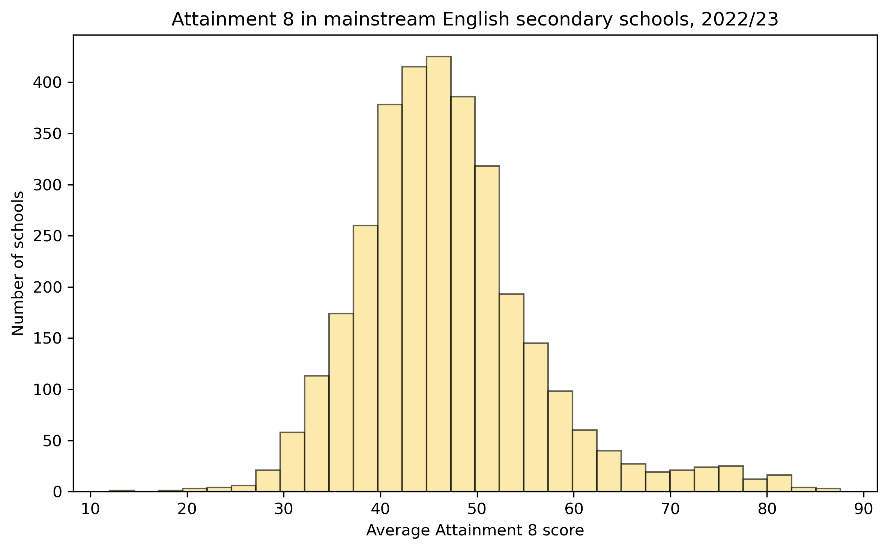
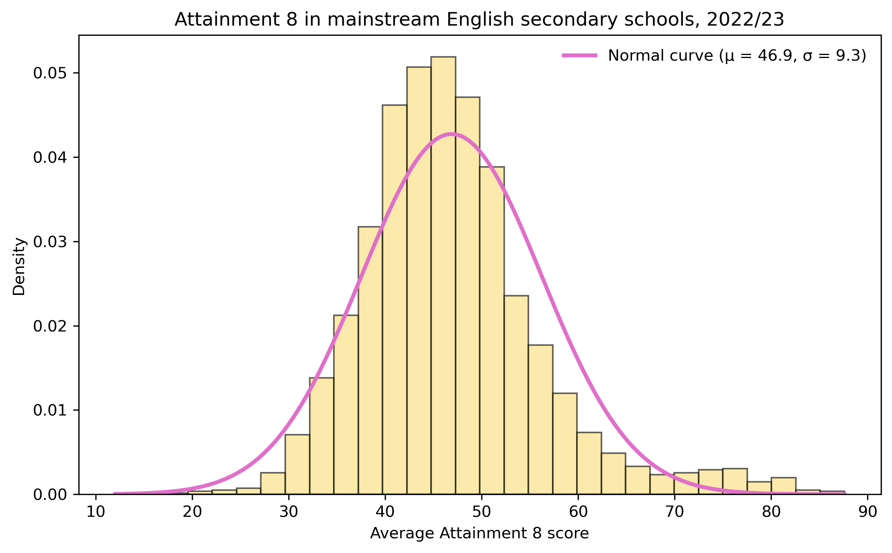
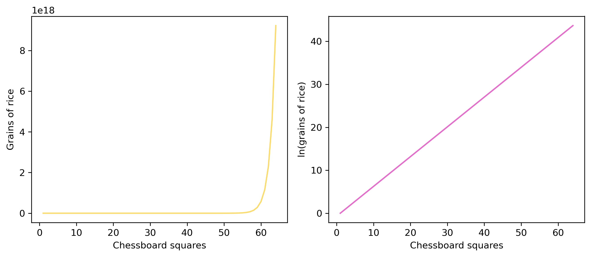
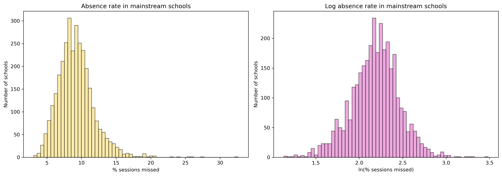

## Last week 
*Exploratory data analysis, part 1*

- Our dataset — DfE school performance in England, 2022/23
- Data types
- Descriptive statistics: distributions, histograms, boxplots
- Descriptive statistics: mean, median, variance, standard deviation
- Making things comparable: counts, rates and standard scores
- Missing data and outliers

::: {.notes}
4 data types: nominal, ordinal, interval, ratio 
Numerical vs categorical 

Key data metrics - the middle: mean, median, mode and the spread: variance and standard deviation

different types of data outliers: caused by measurement error, or irregular pattern or influential outliers 
:::

## This week 
Last week was largely descriptive, this week we go a bit deeper!

::: {.incremental}
-   Last week we talked about histogram's, this week we'll look at probability distributions. These are functions with
    parameters, that you can compute and predict with.
-   We'll look at how data can be processed to make it easier to analyse. 
-   Last week you considered what the population of interest was, this week we will consider different sources of data bias. 
:::

## Learning objectives
By the end of this lecture you should be able to:

::: {.incremental}
1. Describe the characteristic features of common probability distributions
2. Apply exponentials and logarithms to transform data
3. Evaluate whether a dataset is representative
:::


## When descriptive statistics aren't enough {.smaller}

```{python}
#| echo: true
#| output: true 
import pandas as pd 

# read data
df_4datasets = pd.read_csv("L2_data/anscombe_quartet.csv")
# print descriptive statistics
df_4datasets.groupby("dataset").describe()
```

::: {.notes}
all 4 datasets have very similar descriptive statistics of both the x, and y variables. 
:::

## Same same but different 

<div style="text-align:center;">
  
</div>

::: {.notes}
These all have mean x = 9, variance x = 11. mean y = 7.5, variance y =4.1. 

But we can see from the diagrams that the distribution of the data is very different, some is linear, some is elliptic etc... So we need more advanced ways of describing the data. 
:::

# Probability distributions
[A mathematical function that describes the likelihood of different events occuring in a random process.]{style="color:#49a0c4"} 

More sophisticated than descriptive statistics, probability distributions allow us to mathematically approximate the processes which generated the data.

## Continuous vs. Discrete 
How we measure data is important for how we model and analyse it.

. . .

*Continuous* 

[Measurable data which can take any value within a given range.]{style="color:#49a0c4"} 

*Discrete*

[Measurable data which can take seperate, countable values.]{style="color:#49a0c4"}  


## Quiz 

:::: {.columns}

::: {.column width="50%"}

<br>

<div style="text-align:center;">
  
</div>

:::

::: {.column width="50%"}

Is this data continuous or discrete?

::: {.incremental}
1. The air temperature on the platform at Warren Street 
2. The number of tubes arriving at the platform in the next 10 minutes 
3. The distance commuters travel to work 
4. How late a train is, as recorded in the TfL delay log (whole minutes)
:::

:::

::::


::: {.notes}
1. Continuous - temperature can take any value within a range
2. Discrete - number of tubes is a countable value
3. Continuous - distance can take any value within a range
4. Discrete - delay is a countable value (whole minutes), however the underlying distribution before it gets rounded to whole minutes is continuous.
:::

## The probability function 

```{=tex}
\begin{align}
p(x)
\end{align}
```

Having a function for the distribution allows us to evaluate the probability of events, and hence (*spoiler alert for lecture 3*) evaluate hypotheses. 

. . .


- continuous distributions -> probability density functions (PDFs)
- discrete distributions -> probability mass functions (PMFs)

## Key distributions {.smaller}

| | Normal | Binomial | Poisson | Exponential |
|:--|:--|:--|:--|:--|
| [Type]{style="color:#49a0c4"}  | Continuous | Discrete | Discrete | Continuous |
| [Shape]{style="color:#49a0c4"} | Symmetric, one peak | Depends on $p$; symmetric if $p=0.5$ | Right-skewed (more symmetric as $\lambda$ grows) | Right-skewed, highest at zero |
| [Parameters]{style="color:#49a0c4"}  | $\mu$, $\sigma$ | $n$, $p$ | $\lambda$ | $\lambda$ |
| [Probability function]{style="color:#49a0c4"}  | PDF | PMF | PMF | PDF |

# Normal distribution
The most fundamental distribution

---

<div style="text-align:center;">
  
</div>


::: {.notes}

Talked about this last week - in terms of things being approxiamtely normal. 

Also known as Gaussian distribution after Gauss. 
The shape is known as the bell curve. 

- Human height
- Petal size (specifically length of iris petals)
- blood pressure
- birth weight of babies 
- measurement errors in science experiments 
:::

## Key features

::: {.incremental}
- Data is continuous 
  - it is something you measure not something you count
- It is symmetric 
  - data is equally likely to be larger or smaller than average 
- It has a characteristic size 
  - there is a single peak, with all data points close to the mean 
- There are smooth tails 
  - there is less data further away from the mean 
:::

## See it in histograms {.smaller}

<div style="text-align:center;">
  
</div>

::: {.notes}
Same data as last week: Attainment 8 scores, restricted to mainstream state-funded secondaries so we're comparing like with like 
:::

## Approximately normal {.smaller}

<div style="text-align:center;">
  
</div>

## Uniquely described by two variables...

<div style="text-align:center;">
  
</div>

## ...and a probability density function

<div style="text-align:center;">
  
</div>

[*The probability density function (PDF) describes the likelihood of different outcomes for a continuous random variable*]{style="color:#49a0c4"} 


## Random variable 
[*A random variable is a way to map the outcome of a random process to a probability.*]{style="color:#49a0c4"} 

In mathematical notation, a random variable $X$ is approximately normally distributed about a mean of $\mu$ with a standard deviation of $\sigma$:  

```{=tex}
\begin{align}
X \sim N(\mu,\sigma)
\end{align}
```


## Sampling distributions {.smaller}
[*The distribution of a statistic (e.g. the sample mean) across all the samples of size $n$ we could have drawn.*]{style="color:#49a0c4"} 

. . .

The standard deviation of the sampling distribution of the mean (the *standard error*) is: 

```{=tex}
\begin{align}
\frac{\sigma}{\sqrt{n}}
\end{align}
```

As $n$ increases, the sampling distribution gets less spread out — more certainty about the mean. 

. . .

<div style="background-color:
#2e6260; color:white; padding:8px; border-radius:5px; margin-top:10px;"> <em>Central limit theorem</em>

As the sample size $n$ grows, the sampling distribution of the mean tends towards normal — whatever the shape of the original data. </div>


::: {.notes}
Typically we think of the distribution as describing the entirety of the relevant popualtion - i.e. every relevant example. Link to sampling - normally only have a subset of the data. 

Need to account for the fact that we don't have all the data. So our statistic will vary a bit according to what sample of the data we're looking at. 

In practise - as the sample size increases the sampling distribution of the normal distribution becomes more and more centralised. I.e. we have more certainty about the distribution. 
:::

## Calculating probabilities {.smaller}

Can use the PDF to evaluate the probability at a specific point. 

```{=tex}
\begin{align}
X \sim N(0,1)
\end{align}
```

. . .

```{=tex}
\begin{align}
p(x) = \frac{1}{\sqrt{2 \pi \sigma^2}} e^{-\frac{(x-\mu)^2}{2\sigma^2}}
\end{align}
```

. . . 

Or the probability of a range of values by integrating the PDF:


```{python}
#| echo: true
#| output: true 
import scipy.stats as sps

mu = 0
std = 1

x_dash = 0.5

# probability x>0.5
prob = 1 - sps.norm.cdf(x_dash, loc=mu, scale=std)
print(f"Probability x > {x_dash}: {prob:.4f}")
```


# Binomial distribution 

## Coin toss 

:::: {.columns}

::: {.column width="50%"}

::: {.incremental}
- I flip a coin 10 times
- How often can I expect to get at least 7 heads? 
:::

:::

::: {.column width="50%"}

<br>
<br>

<div style="text-align:center;">
  
</div>

:::

::::

::: {.notes}
**Discrete outcomes**
Describes the frequency of successes in a test with 2 outcomes. 
Coin flip is the classic example - have exactly two outcomes, either heads or tails. 
:::

## Probability mass function 

```{=tex}
\begin{align}
P(X = k) = \binom{n}{k} p^k (1-p)^{n-k}
\end{align}
```

Where $n$ is the number of trials, and $p$ is the probability of success for each trial. 

<br>

[*The probability mass function (PMF) describes the likelihood of different outcomes for a discrete random variable*]{style="color:#49a0c4"} 

::: {.notes}
Note the combination here. 
:::

## Plotting the distribution

<div style="text-align:center;">
  
</div>

## Example 1: a council survey {.smaller}

::: {.incremental}
- Southwark council asks 200 randomly chosen residents whether they support a new cycle lane by Waterloo station.
- Suppose we know that residents are *really* split 60/40 in favour of the new cycle lane.
  - **$n=200$, $p=0.6$**
- How likely is it that 120 or more say yes, just by chance? 
  - **$k \geq 120$**
:::

. . .

```{python}
#| echo: true
#| output: true
from scipy.stats import binom

# P(X >= 120) = P(X > 119)
p = binom.sf(119, n=200, p=0.6)
print("Probability X >= 120: {}".format(round(p, 4)))
```


::: {.notes}
Will return to the idea of hypothesis testing in week 3.
:::

# Poisson distribution 

## Death by horse kicks 

:::: {.columns}

::: {.column width="50%"}

::: {.incremental}
- It's 1894. 
- You're the statistician Ladislaus Bortkiewicz.
- And you're wondering, 
- How many soldiers in the Prussian army have been killed by horse kicks?
:::

:::

::: {.column width="50%"}

<br>

<div style="text-align:center;">
  
  <div style="font-size:0.8em; color: #555; margin-top:4px;">
    Hussars trying not to get trampled by horses. Image credit: https://en.wikipedia.org/wiki/Prussian_Army
  </div>
</div>

:::

::::

## Measuring rare events

::: {.incremental}
- Imagine a situation where certain rare events can occur in an *independent* fashion. 
- The Poisson distribution estimates how many such events are expected within a time interval
  - Fixed time interval (e.g. one minute)
  - Fixed rate of events ($\lambda$)
-	Poisson distribution gives the probability of $k$ events.
:::

::: {.notes}
Typically used to measure rare events like mail arriving or death by horse kicks. 
::: 

## Probability mass function 

```{=tex}
\begin{align}
P(X = k) = \frac{\lambda^k e^{- \lambda}}{k!}
\end{align}
```

Where $\lambda$ is the expected number of events in a given interval.

## Plotting the distribution 

<div style="text-align:center;">
  
</div>


## Example 1: bike-share arrivals {.smaller}

:::: {.columns}

::: {.column width="50%"}

::: {.incremental}
- A docking station receives on average 0.5 Lime bikes per minute 
- How likely is it that no bikes arrive in the next 10 minutes? 
- How likely is it that 8 or more bikes arrive? 
:::


```{python}
#| echo: true
#| output: true
from scipy.stats import poisson

lambda_10min = 0.5 * 10  # expected arrivals in 10 minutes

p_no_arrivals = poisson.pmf(0, mu=lambda_10min)
p_8_or_more_arrivals = poisson.sf(7, mu=lambda_10min)

print("Probability of no arrivals: {}".format(round(p_no_arrivals, 4)))
print("Probability of 8 or more arrivals: {}".format(round(p_8_or_more_arrivals, 4)))
```

:::

::: {.column width="50%"}
<div style="text-align:center;">
  
  <div style="font-size:0.8em; color: #555; margin-top:4px;">
    Timmy C found a bike in time.
  </div>
</div>
:::

::::

::: {.notes}
Hopefully a slightly more relatable example than getting kicked to death by a horse. 

Note that lambda scales with the interval: 0.5 per minute is 5 per ten minutes. The assumptions box is a seed for spatial dependence later in the course (events in space are often not independent).
:::


## Example 2: trees in a forest {.smaller}

:::: {.columns}

::: {.column width="50%"}

::: {.incremental}
- London Plane trees are randomly distirbuted in London's parks, with an average of 2 trees per 100m².
- What is the probability of finding exactly 3 trees in a 100m² area of Hyde Park?
:::


```{python}
#| echo: true
#| output: true
from scipy.stats import poisson

lambda_trees = 2  # expected trees in 100m²

p_3_trees = poisson.pmf(3, mu=lambda_trees)

print("Probability of finding exactly 3 trees: {}".format(round(p_3_trees, 4)))
```

:::

::: {.column width="50%"}
<div style="text-align:center;">
  
  <div style="font-size:0.8em; color: #555; margin-top:4px;">
    A London Plane tree in Wandsworth Park.
  </div>
</div>
:::

::::

# Exponentials and Logarithms 

## Exponentials

If the Poisson measures the probability of $x$ events within a time period, then the exponential measures how long we are likely to wait between events.

. . .

So what is the exponential function?

. . .

[*"The greatest shortcoming of the human race is our inability to understand the exponential function"* – Albert Bartlett (physicist)]{style="color:#49a0c4"} 

::: {.notes}
He's a bit dramatic
:::

## A game of chess...

:::: {.columns}

::: {.column width="50%"}

- A scholar has invented chess
- The emperor is really grateful and asks the scholar to choose a gift in recompense
- The scholar asks for grains of rice  
- Specifically, rice to fill the chessboard, such that the number of grains double on each square 

:::

::: {.column width="50%"}

<div style="text-align:center;">
  
  <div style="font-size:0.8em; color: #555; margin-top:4px;">
    Krishna and Radha playing chaturanga - the precursor to chess. Image credit: https://en.wikipedia.org/wiki/Chaturanga
  </div>
</div>

:::

::::

::: {.notes}
Famous story, of the man who invented chess. 
Emperor was so grateful, he said what do you want in return 
The man asked for rice, such that on each square of the chess board, the number of grains of rice doubled. 
The Emperor thought this was a really small ask for such a great invention. He asked if he didn't want a better gift. 
But the man insisted that what he wanted was rice. 

Image is of Chatarunga - which is the earliest known form of chess dating to 6th century AD northern India. Not to be confused with the yoga pose. 
:::

## ...and rice 

<div style="text-align:center;">
  
</div>

::: {.notes}
A bowl of rice is around 4,000 grains. 

By the final square have 10^18 grains - which is more than the global production of rice.  
:::


## What does this look like on a graph?

<div style="text-align:center;">
  
</div>


## Generally we have

<div style="text-align:center;">
  
</div>


## The exponential function

The (natural) exponential function is:

```{=tex}
\begin{align}
y=e^x
\end{align}
```

- $e \approx 2.718...$ is eulers number - a mathematical constant. 

::: {.notes}
Its a mathematical constant similar to pi - it's just a fixed number which we have a name for. 
Like pi comes from geometry (circles etc), e comes from the limit of the equation of compound interest. 
:::

## The exponential distribution

<div style="text-align:center;">
  
</div>

::: {.notes}
We've talked about the exp function - but now want to talk about the exp distribution. 

This is a continous probability distribution. 
:::

## Probability density function {.smaller}

The PDF of the exponential distribution is: 

```{=tex}
\begin{align}
P(x) = \lambda e^{-\lambda x}
\end{align}
```

where $\lambda$ is the rate parameter. 

As in the poisson distribution $\lambda$ is the fixed rates of events for a predetermined time interval. 

<div style="background-color:#2e6260; color:white; padding:8px; border-radius:5px; margin-top:10px;"> <em>Note</em> 

This is sometimes referred to as the *negative exponential distribution* - as it is a negative exponent. </div>

. . .

Traditionally used to model time between rare events. 

- time between volcanic eruptions 
- time between customers entering a shop 
- time of radioactive decay 

## Example 1: wait time for a bike-share arrival {.smaller}

:::: {.columns}

::: {.column width="50%"}
- One Lime bike arrives at the docking station every minute. 
- What is the probability that it will be ten minutes until the next bike arrives?
  - $\lambda=1$ 
  - $p(10) = 1 \times e^{-1 \times 10}$

```{python}
#| echo: true
#| output: true
from scipy.stats import expon

lambda_1min = 1  # rate per minute
x = 10  # time in minutes

p_10min = expon.pdf(x, scale=1/lambda_1min)

print("Probability of 10 minutes until next bike arrives: {}".format(round(p_10min, 4)))
```

:::

::: {.column width="50%"}
<div style="text-align:center;">
  
  <div style="font-size:0.8em; color: #555; margin-top:4px;">
    Timmy C found a bike in time.
  </div>
</div>
:::

::::

## Example 2: wait time for a bike-share arrival {.smaller}

- One Lime bike arrives at the docking station every minute. 
- What is the time at which the probability of a bike arrival is 0.5?
  - $\lambda=1$ 
  - $0.5 = p(x) = 1 \times e^{-1 \times x}$
  - what is $x$?

. . . 

This is easier said than done – the best way is to invert the equation.

## Inverse operations 
[*The mathematical operation that reverses.*]{style="color:#49a0c4"} 

Subtract is the inverse of adding. 
```{=tex}
\begin{align}
2 + x=5 \implies 5-2=x
\end{align}
```
Divide is the inverse of multiplying.
```{=tex}
\begin{align}
2 \times x =6 \implies 6 \div 2=x
\end{align}
```

## Logarithms 

Taking the logarithm is the inverse of taking the exponential. 

. . .

```{=tex}
\begin{align}
2^3 = 8 \implies \log_2(8) =3
\end{align}
```

. . .

More generally: 
```{=tex}
\begin{align}
a^x = b \implies \log_a(b) =x
\end{align}
```

. . .

For the natural logarithm:
```{=tex}
\begin{align}
e^x = b \implies \log_e(b) =ln(b) = x
\end{align}
```

::: {.notes}
Multiply and divide are inverse operations of one another (they reverse the process). 

Read the equation as log of 8 base 2 equals 3. 
:::

## Natural logarithm 

<div style="text-align:center;">
  
</div>

## Probability distributions {.smaller}

| | Normal | Binomial | Poisson | Exponential |
|:--|:--|:--|:--|:--|
| **Type** | Continuous | Discrete | Discrete | Continuous |
| **Shape** | Symmetric, one peak | Depends on $p$; symmetric if $p=0.5$ | Right-skewed (more symmetric as $\lambda$ grows) | Right-skewed, highest at zero |
| **Parameters** | $\mu$, $\sigma$ | $n$, $p$ | $\lambda$ | $\lambda$ |
| **Probability function** | PDF | PMF | PMF | PDF |


# Transforming data 

## Why transform?
Because logarithms undo exponentials, they give us two very useful tools for data: 

::: {.incremental}
1. **Straighten** exponential growth 
2. **Tame** long right tails 
:::

. . .

The most important rules: 

```{=tex}
\begin{align}
log_a(a^x) = x
\\ ln(e^x) = x
\end{align}
```

## *Log it!* to straighten growth 

As the logarithm inverses the exponential, taking the logarithm of an exponential function will result in a linear relationship.

<div style="text-align:center;">
  
</div>

## *Log it!* to tame long tails

Long right tail, no typical size: most schools cluster at low absence, but a few sit far out — after the log it looks much closer to normal.

<div style="text-align:center;">
  
</div>

::: {.notes}
Same schools data as the rest of this deck: absence rate (PERCTOT), mainstream state-funded secondaries only.
:::

# Representative data
**Before we try to describe the data, it's important to know where the data came from.**

## The dream vs reality 
Ideally, we would like all the relevant data.

. . .

... in reality we normally only have some. 

<div style="text-align:center;">
  
</div>

::: {.notes}
It would be great if I knew the height of everyone at UCL, but unrealistic to collect – however maybe I could collect all students in this lecture theatre.  
:::

## Approximating 
Hence, we sample a subset of the data. 
We need to choose our sample carefully - we want what happens in the sample to approximate what happens in the whole population. 

. . .

**In practise** we might try different sampling approaches such as:

::: {.incremental}
- random sampling 
- systematic sampling 
:::

::: {.notes}
I might assign everyone a number and then choose 100 random numbers and measure them. Or I might choose a specific subset, for exampel just everyone in this lecture theatre. 
:::

## Bias
It's important to understand if your dataset is unrepresentative or biased. 

<div style="text-align:center;">
  
</div>

::: {.notes}
Bias is the idea that there is an unrepresentative pattern in your data.
:::

## Where does bias creep in? 
Three places, three questions: 

::: {.incremental}
- **In the sample**: *selection bias*. Who ended up in the data, and who didn't? 
- **In the world**: *historical bias*. What existing inequalities does the data reflect? 
- **In the analyst**: *cognitive bias*. What did we choose to collect, keep and report? 
:::

. . .

Particularly important for large datasets and AI models, where patterns that aren't obvious to us can reflect these biases. 

::: {.notes}
Already talked about the idea of cognitive bias. There are lots and lots of different types of biases - going to talk a little about different ways they can bias the dataset. 

Dataset bias has become a more prevalent topic of concern on the era of large AI models. These models are really good at learnign patterns which aren't obvious to the human eye - but the pattern might reflect a bias. For example generative AI models learn that scientists are white men, even though if I asked you you'd tell me anyone can be a scientist. 

- [Hungry judges](https://daniellakens.blogspot.com/2017/07/impossibly-hungry-judges.html)
:::


## Selection bias 
[*When the sample chosen doesn’t represent the whole population of interest*]{style="color:#49a0c4"} 

Examples: 

- Self selection [Roy Model](https://en.wikipedia.org/wiki/Roy_model) 
  - Underlying characteristics of people who self select into certain groups. 
- [WEIRD people](https://oecs.mit.edu/pub/spow8trw/release/1) 
  - Commonly sampled in behavioural sciences. 
  - Reflects a very small proportion of global population. 
- 2001 Westminster census - reflected less people than expected, as high numbers of second homes 

::: {.notes}
Roy model - example from economics - basically there's not a random selection of people in a specific job - thye have chosen that job based on underlying unobserved characterisitcs. For example suppose I'm interested in wages of workers in different occupations - but they have self-selected into that occupation based on their unique skill set - so it's a biased representation. 

WEIRD = western, educated, industrialised, rich, democratic
:::

## Historical bias
[*Reflects existing, real world, inequalities*]{style="color:#49a0c4"} 

Examples: 

- [Police profiling](https://www.amnesty.org.uk/press-releases/uk-police-forces-supercharging-racism-crime-predicting-tech-new-report) 
  - Automated tools to detect 'criminals'. 
  - Trained on datasets which reflect current racist practises. 

::: {.notes}
Police profiling models - meant to make easy to spot criminals - but use exisitng crime data - which reflect racist prejudices in society - and the model learns to pick out people of certain ethnic backgrounds. 

Tools also used to help the sentnecing of criminals in courts of law - observe the hungry judges effect, where they sentnece differently based on how hungry they are - tend to be harsher just before lunch and more lenient after lunch. 
:::


## Cognitive bias 
[*Systematic patterns in how we think about, and perceive, the world.*]{style="color:#49a0c4"} 

:::: {.columns}

::: {.column width="50%"}

Our cognitive biases can impact:

::: {.incremental}
- data collection 
- data selection 
- data processing 
- modelling choices
:::

:::

::: {.column width="50%"}

<br>

<div style="text-align:center;">
  
</div>

:::

::::

::: {.notes}

We all have our own cognitive biases - shaped around our values and our backgrounds. 
Example of cognitive bias - confirmation bias, whereby I favour information that agrees with my existing beliefs. I'm writing a report on the spatial impact of a new railway line. Suppose I hate the idea of a new railway line, and then I see some data, fact a: 60% of residents living near the railline don't want it due to noise. fact b: 75% of residents in the UK do want the railway line. i might only include fact a in my report as it confirms my existing beliefs. 
:::

## Why is this important? 

If we're not careful we can propagate bias to the research, and hence results. 

. . .

This can lead to incorrect conclusions. 

::: {.notes}
As scientists we should try and present an accurate and fair balance of information. If we're more aware of our biases it can be easier to try and actively avoid them. 
:::

## Can data ever be truly representative? 

Probably not. 

::: {.notes}
Even when we think we have really good data, someone has made the choice to collect this data. Why that data over other data? Does that data reflect their underlying cognitive biases? For example the choice to collect information of peoples opnion about a new trainline might be driven by a political goal of understanding public support for a new government infrastructure project. 

Not necessarilly a bad thing, but important to keep in mind. And if the bias is noticeable then it should be acknowledged and reported. 
:::

. . .

**Failing that...**
.. we can acknowledge our biases!

<div style="text-align:center;">
  
  <div style="font-size:0.8em; color: #555; margin-top:4px;">
    Image credit: [xkcd](https://xkcd.com/2494/)
  </div>
</div>

# Overview 
We've covered: 

- Normal distribution
- Binomial distribution 
- Poisson distribution 
- Exponentials 
- Logarithms 
- Representative data 

The practical will focus on exploratory data analysis for a variety of different datasets. Have questions prepared!