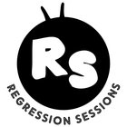

## Introduction

For three weeks the Regression Sessions have rested on an assumption we never questioned: that the thing we are trying to predict is a continuous number, free to wander up and down a straight line without ever embarrassing us.

This week we break it. ***Generalised Linear Models*** keep everything you already know - the linear predictor, the formula interface, the coefficient table - and add two pieces that let the outcome be something other than a continuous, roughly normal number: a ***distribution*** suited to the outcome, and a ***link function*** that connects the two.

| Feature | Ordinary Least Squares (OLS) | Generalised Linear Model (GLM) |
|-------------------|------------------------|-----------------------------|
| **Outcome** | Continuous, roughly normal | Binary, count, proportion, category - whatever you have |
| **Distribution** | Normal, always | Chosen to match the outcome (binomial, Poisson, ...) |
| **Link function** | None (the identity link) | Stretches a bounded outcome onto the whole number line |
| **Fitted by** | Least squares | Maximum likelihood |
| **Goodness of fit** | R², residual plots | Deviance, AIC, pseudo-R² |
| **Example** | Predicting attainment from school intake | Predicting *whether* a school is rated below Good |

OLS is not a different thing from a GLM - it is the GLM with a Normal distribution and the boring link.

## Learning Objectives

By the end of this week, you will:

1.  Be able to tell, from the outcome variable alone, which member of the GLM family you need - the Week 1 material on data types turns out not to have been an academic exercise
2.  Understand what a ***link function*** actually does, and be able to show why a straight line fitted to a 0/1 outcome produces impossible predictions
3.  Be able to fit a ***binary logistic regression*** and, more importantly, explain an ***odds ratio*** out loud in a sentence a non-statistician would understand
4.  Know how to judge whether the model ***fits***, using the log-likelihood, deviance, AIC and the pseudo-R²s - and know what each of them does not tell you
5.  Know how to judge whether the model makes good ***decisions***, against a majority-class baseline, with a confusion matrix, and with ROC and AUC - a set of ideas that applies well beyond logistic regression
6.  Understand the difference between ***explaining*** and ***predicting***, and why deciding which one you are doing changes what counts as a good model
7.  Be able to say what a model of this kind *cannot* tell you, and why that judgement comes from your own knowledge of the data rather than from the output

## Lecture

To access the lecture notes: [Lecture](GLM_lecture_short.html)

Two optional extras, for anyone who wants to go further:

-   [Extended version](GLM_lecture.html) - the same material at greater length, including ordinal and multinomial logistic regression
-   [Volume 5: counts, rates and the negative binomial](GLM_NB.html) - Poisson regression, offsets, overdispersion and the negative binomial

## Quiz

To access the quiz on Moodle, please check [Moodle page](https://moodle.ucl.ac.uk/course/view.php?id=61867).

## Practical

::: callout-note
To save a copy of notebook to your own GitHub Repo: follow the GitHub link, click on `Raw` and then `Save File As...` to save it to your own computer. Make sure to change the extension from `.ipynb.txt` (which will probably be the default) to `.ipynb` before adding the file to *your* GitHub repository.
:::

To access the practical:

1.  [Main Practical Page](GLM_practical.html)
2.  [Download](GLM_practical.ipynb)

## Further resources

-   Shmueli, G. (2010) [To Explain or to Predict?](https://doi.org/10.1214/10-STS330) *Statistical Science*, 25(3), 289-310 - the distinction underneath the whole final section of the lecture
-   O'Hara, R. B. and Kotze, D. J. (2010) [Do not log-transform count data](https://doi.org/10.1111/j.2041-210X.2010.00021.x) *Methods in Ecology and Evolution*, 1(2), 118-122 - why a Poisson GLM beats logging the outcome
